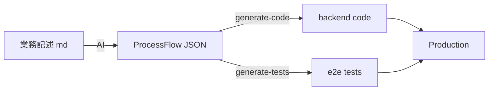

# Phase B 動作確認サンプル

このページは Phase B (HTML 基盤構築) の動作確認用です。Phase C で削除されます。

## コードハイライト (shiki)

JSON:

```json
{
  "schemaVersion": "3.0.2",
  "processFlow": {
    "id": "sample",
    "name": "サンプル",
    "actions": [
      { "id": "act-001", "trigger": { "kind": "submit" }, "steps": [] }
    ]
  }
}
```

TypeScript:

```typescript
interface ProcessFlow {
  schemaVersion: string;
  id: string;
  actions: Action[];
}
```

Bash:

```bash
cd backend && npm run dev
```

## Mermaid 図 (build-time SVG)



## テーブル

| 項目 | 値 |
|---|---|
| schemaVersion | 3.0.2 |
| actions | array |
| trigger.kind | enum |

## リンクテスト

- [トップへ](/)
- [外部リンク (GitHub)](https://github.com/csilost2001/harmony)

## 注釈

> ℹ️ Phase C で `docs/spec/*.md` を全変換した時点で、このサンプルは削除されます。
