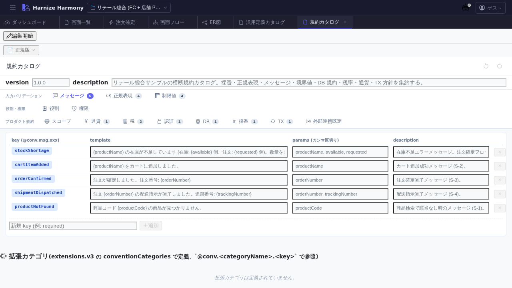

# 横断規約カタログ

> **対象画面**: `ConventionsCatalogView` (`frontend/src/components/conventions/ConventionsCatalogView.tsx`)
> **ルート**: `/w/:wsId/conventions/catalog`
> **種別**: シングルトンタブ

## 概要

プロジェクト横断の規約 (Conventions) を kind 別にカタログ表示する画面。`naming-rule` / `validation-rule` / `lifecycle-rule` / `error-handling-rule` / `expression-evaluation` 等のフレームワーク横断ルールを一覧し、各規約の参照箇所 (どの table / screen / process-flow で使われているか) を確認できる。

## 到達経路

- HeaderMenu → 「規約」 → 「規約カタログ」
- 直接 URL: `/w/<wsId>/conventions/catalog`

## 画面構成

### 主要エリア

1. **ヘッダー** — タイトル「横断規約カタログ」 + 新規追加ボタン
2. **規約一覧** (kind 別グループ)
   - 各規約: 名前 + 適用範囲 (scope) + 適用件数 + 「編集」「参照箇所」ボタン
   - source: project / extension / framework の 3 階層別バッジ
3. **検索 / フィルタ** — 名前部分一致、scope / source / kind での絞込み

## 主要操作

| 操作 | 手段 | 結果 |
|---|---|---|
| 新規規約追加 | 「規約追加」 | kind 選択モーダル → 規約定義入力 |
| 規約編集 | 行の「編集」 | inline / modal で名前 / scope / pattern / 説明を更新 |
| 参照箇所表示 | 行の「参照箇所」 | この規約が適用される table / screen / process-flow 一覧 |
| 適用範囲フィルタ | scope フィルタ | global / per-table / per-screen 等で絞込み |
| 削除 | 行の右クリック → 「削除」 | 参照ありの場合は警告ダイアログ |

## データ前提

- **空状態**: 「規約が未登録です」プレースホルダ
- **意味のある状態**: framework 組込み規約 (例: `validation-rule:require-not-empty`) + project 固有規約 (例: retail の `naming-rule:table-snake-case`)
- **複数 source 混在**: 同名の規約が `framework` と `project` で重複する場合、project が優先

## 関連仕様書

- [`docs/conventions/validation-rules.md`](../../conventions/validation-rules.md) — validation-rule kind の仕様
- [`docs/conventions/expressions.md`](../../conventions/expressions.md) — expression-evaluation kind の仕様
- [`docs/conventions/product-scope.md`](../../conventions/product-scope.md) — scope (project / extension / framework) の階層

## 関連 skill

- なし (新規 skill 未整備、追加時はカタログから手動)

## 既知の制約・注意

- **規約変更の波及範囲は手動確認**。validation-rule を変更しても自動再検証されないため、関連 table / screen を個別に開き直す必要あり (将来 reactive 検証検討余地)
- framework / extension 由来の規約は **read-only** (該当の拡張パッケージで変更)
