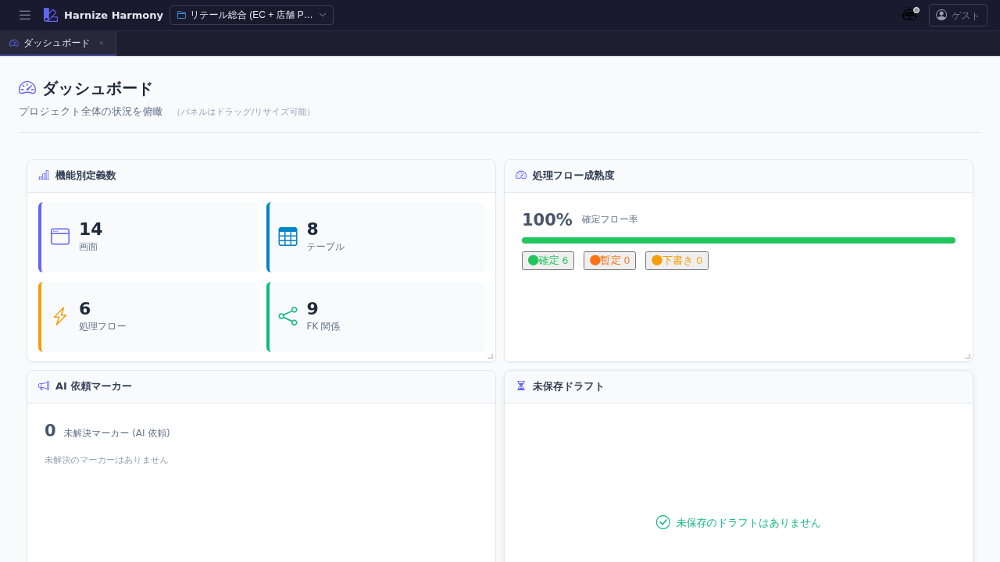

# ダッシュボード

> **対象画面**: `DashboardView` (`frontend/src/components/dashboard/DashboardView.tsx`)
> **ルート**: `/w/:wsId/` (workspace 配下のトップ)
> **種別**: シングルトンタブ

## 概要

プロジェクト全体の状況を一目で俯瞰するパネル集合体。機能別定義数 / 処理フロー成熟度 / AI 依頼マーカー / 未保存ドラフト / 最近編集したもの の 5 パネルを `react-grid-layout` でドラッグ・リサイズ可能に配置できる。レイアウトはブラウザの localStorage (`dashboard-layout-v1`) に永続化されるため、各利用者の好みでカスタマイズ可。

## 到達経路

- ワークスペースを選択した直後に最初に表示される (ホーム位置)
- HeaderMenu → 左端のロゴ / 「ダッシュボード」アイコン
- 直接 URL: `/w/<wsId>/`

## 画面構成

### 主要エリア

1. **ヘッダー** — タイトル「ダッシュボード」+ 副題「プロジェクト全体の状況を俯瞰 (パネルはドラッグ/リサイズ可能)」
2. **パネルグリッド** — 5 つの情報パネル (順序・サイズは利用者がカスタマイズ可)
   1. **機能別定義数** (`function-counts`) — 画面 / テーブル / 処理フロー等の件数
   2. **処理フロー成熟度** (`process-flow-maturity`) — draft / committed の比率を可視化
   3. **AI 依頼マーカー** (`markers-summary`) — 未解決のマーカー (指示・質問・TODO) 件数
   4. **未保存ドラフト** (`unsaved-drafts`) — `data/.drafts/<wsId>/` に残っているドラフト一覧
   5. **最近編集したもの** (`recent-edits`) — 直近編集リソースのジャンプ用リンク

## 主要操作

| 操作 | 手段 | 結果 |
|---|---|---|
| パネル位置を変更 | パネルヘッダ (タイトル部分) をドラッグ | レイアウト保存、次回起動時も復元 |
| パネルサイズを変更 | パネル右下のリサイズハンドルをドラッグ | サイズ保存 |
| パネルから別画面へ遷移 | 各パネル内のリンク / ボタンをクリック | 対応する一覧 / Editor が新タブで開く |
| レイアウトをリセット | localStorage の `dashboard-layout-v1` を削除 → ブラウザリロード | デフォルト配置に戻る |

## データ前提

- **空状態**: ワークスペース直後は全パネルが「0 件」表示。`function-counts` 以外は意味のあるデータが無い
- **意味のある状態**: 何らかのリソース (画面 / テーブル / 処理フロー) が登録されると各パネルに値が入る
- **AI 依頼マーカー**を活かすには、designer 画面で右クリック → マーカー追加で課題を書き込んでおく必要がある (`/designer-work` skill 参照)

## 関連仕様書

- [`docs/spec/workspace.md`](../../spec/workspace.md) — ワークスペースと dataDir の関係 (`recent-edits` の対象範囲)
- [`docs/spec/draft-state-policy.md`](../../spec/draft-state-policy.md) — `unsaved-drafts` の severity 判定基準
- [`docs/spec/process-flow-maturity.md`](../../spec/process-flow-maturity.md) — `process-flow-maturity` パネルが表示する成熟度

## 関連 skill

- `/designer-work` — designer 画面で書いたマーカーを Claude Code に処理させる (`markers-summary` パネルに反映)
- `/create-flow` — 処理フローを作成 (作成すると `process-flow-maturity` / `function-counts` に反映)

## 既知の制約・注意

- `react-grid-layout` の WidthProvider はマウント時の親要素幅で col 数を決定する。サイドバー開閉直後の遅延 mount で誤判定する場合あり (リロードで解消)
- レイアウトの永続化は **localStorage 単位 (ブラウザ単位)**。別 PC / 別ブラウザでは別のレイアウトになる
- パネルが未登録の workspace では「パネルが未登録です (Issue #86 PR-5 以降で追加予定)」のプレースホルダが表示される (歴史的経緯による文言)
