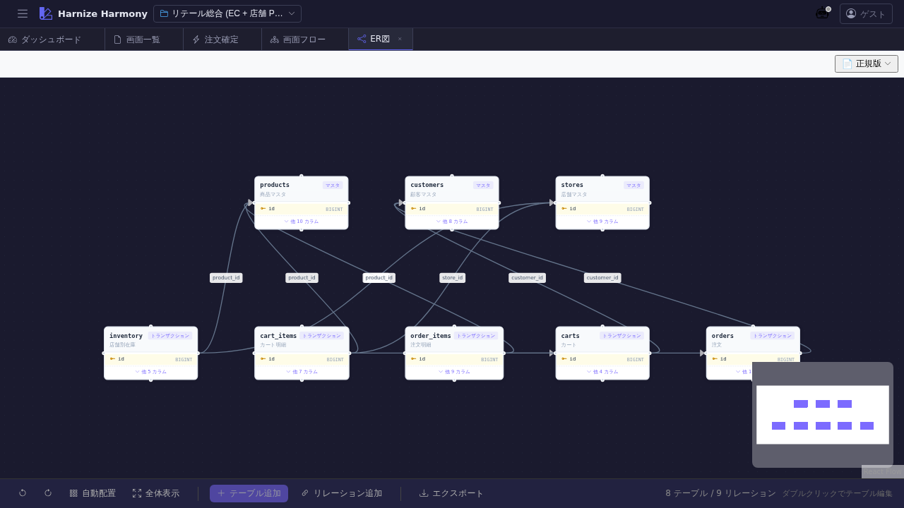

# ER 図

> **対象画面**: `ErDiagram` (`frontend/src/components/table/ErDiagram.tsx`)
> **ルート**: `/w/:wsId/table/er`
> **種別**: シングルトンタブ

## 概要

プロジェクトの全テーブル (Table リソース) のリレーションを **Mermaid ER 図** で可視化する。`generate_er_mermaid` MCP tool で生成される ER 図を表示し、エンティティ間の relation (1-N / N-1 等) を一覧する。テーブル定義の整合性レビューやドメインモデル説明資料として利用。

## 到達経路

- HeaderMenu → 「テーブル」→ 「ER 図」
- ダッシュボード「機能別定義数」パネル → テーブル数バッジクリック
- 直接 URL: `/w/<wsId>/table/er`

## 画面構成

### 主要エリア

1. **ヘッダー** — タイトル「ER 図」+ 再生成ボタン + 形式切替
2. **Mermaid ER 図エリア** — SVG 描画されたエンティティ群と relation
   - 各エンティティ: テーブル名 + カラム一覧 (PK / FK アイコン付き)
   - relation 線: 1-1 / 1-N / N-M を Mermaid 記法で表現
3. **エラー表示** — Mermaid syntax error / 参照不整合があればここに表示

## 主要操作

| 操作 | 手段 | 結果 |
|---|---|---|
| 再生成 | 「再生成」ボタン | テーブル定義から ER 図を再構築 (テーブル追加 / カラム変更後に手動更新) |
| Mermaid ソース表示 | 「ソース表示」切替 | SVG 図と Mermaid テキストを切替 |
| テーブル定義ジャンプ | エンティティクリック (一部対応) | `/table/edit/:id` を新タブで開く |
| ズーム | ブラウザの ctrl+scroll | SVG 拡大縮小 |

## データ前提

- **空状態**: 「テーブルが未登録です」プレースホルダ、何も描画されない
- **意味のある状態**: retail サンプルでは Order / OrderItem / Customer / Product / Inventory 等 10+ テーブル + 主要 FK が描画される
- relation は **table の `foreignKeys` / `relations` フィールド** から自動推定。明示的に書いていない場合は edge が出ない

## 関連仕様書

- [`docs/spec/schema-design-principles.md`](../../spec/schema-design-principles.md) — テーブル / カラムの命名規約 (ER 図にも反映)

## 関連 skill

- `/generate-code` の `prisma` / `flyway` 系 techStack で本 ER 図と整合する DDL を生成可能

## 既知の制約・注意

- **手動再生成式** — テーブル定義を変更しても自動再描画されない (パフォーマンス対策)
- Mermaid v10 系の表現範囲内 (super-type / interface 系の継承は未対応)
- 大規模スキーマ (50+ テーブル) では一覧性が落ちるため、サブセット表示の将来検討余地あり
