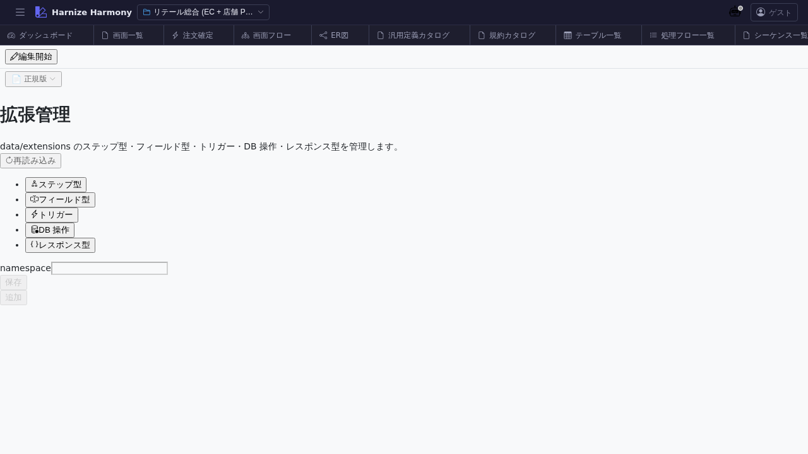

# 拡張管理

> **対象画面**: `ExtensionsPanel` (`frontend/src/components/extensions/ExtensionsPanel.tsx`)
> **ルート**: `/w/:wsId/extensions`
> **種別**: シングルトンタブ

## 概要

プロジェクトが採用している **拡張パッケージ (extensions)** を一覧・管理する画面。Harmony 本体には組込まれていない業界特化機能 (`retail` / `finance` / `healthcare` 等の namespace) を bundle 化したもので、追加の Step / Action / FieldType / DBOperation 等を有効化する。

## 到達経路

- HeaderMenu → 「拡張管理」
- ダッシュボード「拡張」パネル
- 直接 URL: `/w/<wsId>/extensions`

## 画面構成

### 主要エリア

1. **ヘッダー** — タイトル「拡張管理」 + 「拡張を追加」
2. **適用済み拡張一覧** — namespace / バージョン / source (project / framework) / 提供機能サマリ
3. **利用可能拡張** — まだ適用していない拡張カタログ
4. **詳細パネル** (拡張クリック時) — 提供 Step / Action / FieldType / Conventions 等を分類表示

## 主要操作

| 操作 | 手段 | 結果 |
|---|---|---|
| 拡張追加 | 「拡張を追加」 → 利用可能カタログから選択 | `harmony.json` の `extensionsApplied[]` に登録、拡張提供機能が UI / process-flow Editor 等で選べるようになる |
| バージョン指定 | 行のバージョン dropdown | semver range で指定 (`>=1.0.0` 等) |
| 詳細表示 | 行クリック | 提供機能 (Step / Action / Convention 等) を分類表示 |
| 削除 | 行の「削除」 | 拡張依存ありの flow / table がある場合は警告 |
| 拡張を新規作成 (開発者向け) | 「+ 新しい拡張を作成」 | extension scaffold ダイアログ |

## データ前提

- **空状態**: framework 提供分のみ表示、project は extensions なし
- **意味のある状態**: retail の `retail` namespace 拡張が適用されている (`cart` Step 等のカスタム機能を提供)

## 関連仕様書

- [`docs/spec/plugin-system.md`](../../spec/plugin-system.md) — 拡張パッケージのアーキテクチャ (#444 系)
- [`docs/spec/process-flow-extensions.md`](../../spec/process-flow-extensions.md) — Step / Action 拡張機構

## 関連 skill

- なし (拡張自体の開発は repo 全体の作業)

## 既知の制約・注意

- 拡張削除時の **process-flow の Step 失効** に注意 (Step 種別が不明になり error)
- 拡張の binary 配布は将来課題 ([`docs/setup/distribution-roadmap.md`](../../setup/distribution-roadmap.md))、現状は monorepo 内開発
