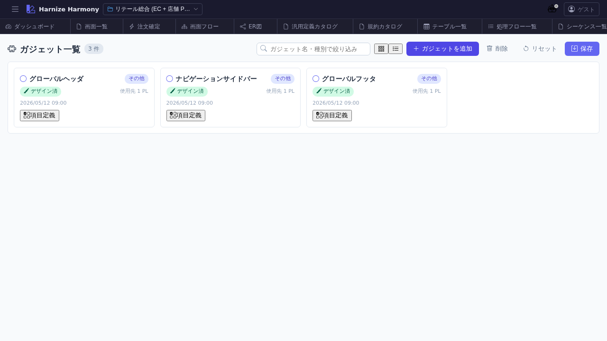

# ガジェット一覧

> **対象画面**: `GadgetListView` (`frontend/src/components/gadget/GadgetListView.tsx`)
> **ルート**: `/w/:wsId/gadget/list`
> **種別**: シングルトンタブ

## 概要

ガジェット (`Screen.purpose='gadget'`) を一覧する。PageLayout のヘッダ / サイドバー / ダッシュボードの中に配置される小さな再利用 UI 部品 (時計 / 通知ベル / ユーザーメニュー / プロモバナー 等) を、通常の Screen と分離して管理する画面。RFC #1021 / pl-4。

## 到達経路

- HeaderMenu → 「ガジェット」 → 「一覧」
- PageLayoutDesigner からの「ガジェット追加」ダイアログ経由
- 直接 URL: `/w/<wsId>/gadget/list`

## 画面構成

### 主要エリア

1. **ヘッダー** — タイトル「ガジェット一覧」 + 件数 + 「ガジェットを追加」
2. **一覧** — ガジェット名 / 想定スロット (header / sidebar / footer / dashboard / inline) / 利用先 PageLayout 数 / 成熟度

## 主要操作

| 操作 | 手段 | 結果 |
|---|---|---|
| 新規作成 | 「ガジェットを追加」 | `Screen` を `purpose='gadget'` で生成、Designer 新タブ |
| デザイン編集 | カード / 行クリック | `/screen/design/:id` (Designer、ガジェット用 viewport) |
| 項目編集 | 行のアイコン | `/screen/items/:id` 新タブ |
| 削除 | 右クリック → 「削除」 / `Delete` | PageLayout 参照ありは警告 |
| rename | 右クリック → 「ID 変更…」 / `F2` | RenameEntityDialog |

## データ前提

- **空状態**: 「ガジェットが未登録です」
- **意味のある状態**: retail でヘッダ用ガジェット (header-clock / header-gadget-handler 等) が登録される
- **`screen/list` には出ない**: `Screen.purpose !== 'gadget'` でフィルタされるため、本画面が canonical な置き場

## 関連仕様書

- [`docs/spec/page-layout.md`](../../spec/page-layout.md) — gadget の責務 / PageLayout との関係
- [`docs/spec/list-common.md`](../../spec/list-common.md)

## 関連 skill

- なし

## 既知の制約・注意

- ガジェットは **Screen の 1 種**だが、`purpose='gadget'` でカテゴリ分離。通常の画面遷移 (route) 対象外
- gadget の編集には PageLayout 側との contract (slot プロパティ等) を意識すること
