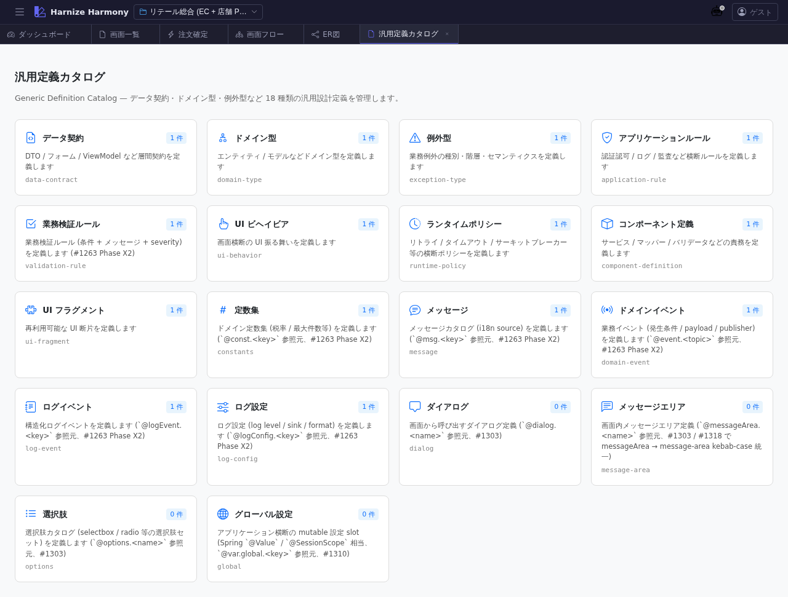

# 汎用定義カタログ

> **対象画面**: `GenericDefinitionCatalogView` (`frontend/src/components/generic-definition/GenericDefinitionCatalogView.tsx`)
> **ルート**: `/w/:wsId/generic-definition`
> **種別**: シングルトンタブ

## 概要

プロジェクト内の **汎用定義 (Generic Definition)** を kind 別に俯瞰するカタログ画面。`component-definition` / `constants` / `data-contract` / `domain-event` / `application-rule` / `policy` / `glossary-term` / `rfc` の 8 kind を分類し、各 kind の件数 + 主要エントリのプレビューを並べる。

## 到達経路

- HeaderMenu → 「汎用定義」 → 「カタログ」
- ダッシュボード「機能別定義数」パネル → 汎用定義リンク
- 直接 URL: `/w/<wsId>/generic-definition`

## 画面構成

### 主要エリア

1. **ヘッダー** — タイトル「汎用定義カタログ」 + kind 一括追加ボタン
2. **kind 別カード** — 8 kind それぞれ 1 カード
   - kind 名 + 件数 + 主要 3-5 件のエントリプレビュー
   - 「この kind の一覧へ」リンク → `/generic-definition/:kind`

## 主要操作

| 操作 | 手段 | 結果 |
|---|---|---|
| kind 一覧画面へ | 各カードの「一覧へ」 | `/generic-definition/<kind>` に新タブ遷移 |
| 個別定義編集へ | エントリプレビューのリンク | `/generic-definition/<kind>/<name>` に遷移 |
| 新規 kind 追加 | 「kind 追加」ボタン | 利用可能 kind 一覧から選択 |

## データ前提

- **空状態**: 全 kind が「0 件」表示
- **意味のある状態**: retail サンプルでは `component-definition: 1` (OrderValidator)、`constants: 1` (OrderConstants)、`data-contract`、`domain-event`、`application-rule` 各複数 件
- generic definitions は **AJV validation 対象外** (draft-state policy 適用、warning 表示で許容)

## 関連仕様書

- [`docs/spec/generic-definition-layer.md`](../../spec/generic-definition-layer.md) — 8 kind の意味 / メタモデル / 命名規約

## 関連 skill

- `/import-md <project>` — 既存 markdown 設計書を generic-definition (data-contract / glossary-term 等) に変換

## 既知の制約・注意

- 各 kind の **必須スキーマは異なる**ため、新規追加時は対応 kind の spec を確認すること
- カタログは **概覧目的**で、編集は個別の `/generic-definition/:kind/:name` Editor 画面で行う
