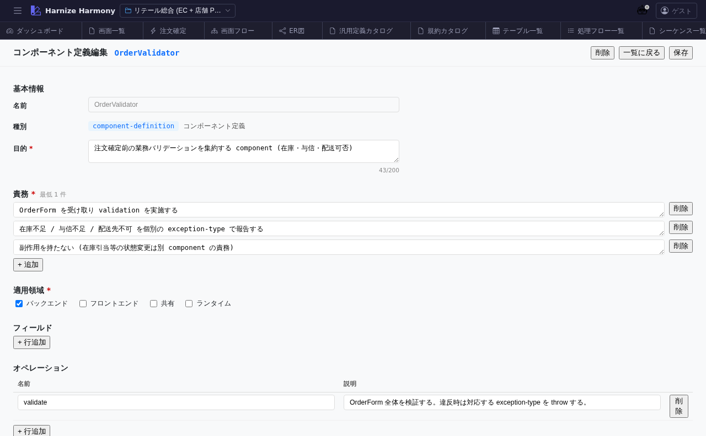

# 汎用定義編集

> **対象画面**: `GenericDefinitionEditor` (`frontend/src/components/generic-definition/GenericDefinitionEditor.tsx`)
> **ルート**: `/w/:wsId/generic-definition/:kind/:name`
> **種別**: マルチインスタンスタブ

## 概要

汎用定義 (Generic Definition) 1 件を編集する画面。kind に応じた form を出し分け、`component-definition` ならコンポーネント仕様 / `constants` なら定数集合 / `data-contract` ならフィールド契約 / `glossary-term` なら用語集エントリ などを編集する。

## 到達経路

- 汎用定義一覧 (kind 別) (`/generic-definition/:kind`) → 行クリック
- 汎用定義カタログ (`/generic-definition`) のエントリプレビューリンク
- 直接 URL: `/w/<wsId>/generic-definition/<kind>/<name>` (例: `/generic-definition/component-definition/OrderValidator`)

## 画面構成

### 主要エリア

1. **EditorHeader** — 「<kind 表示名>: <name>」 + id 変更 + 保存
2. **メタ情報** — 名前 / 論理名 / 説明 / source / 成熟度
3. **kind 固有 form** — kind ごとに動的に出し分け
   - `component-definition`: props / lifecycle / responsibilities / examples
   - `constants`: key-value 表
   - `data-contract`: fields (name / type / required / description) 表
   - `domain-event`: payload / triggers / consumers
   - `application-rule`: condition / action
   - `policy`: scope / criteria / consequence
   - `glossary-term`: term / definition / aliases / examples
   - `rfc`: status / authors / decision / rationale
4. **JSON プレビュー** (折りたたみ) — schema 準拠の生 JSON

## 主要操作

| 操作 | 手段 | 結果 |
|---|---|---|
| フィールド編集 | 各 form 要素 | inline 編集 |
| 表型フィールド (data-contract / constants) | 「行追加」 / 行ドラッグ / 「削除」 | 表編集 (`DataList` 共通 UI) |
| 保存 / 破棄 | `Ctrl+S` / 「破棄」 | edit-session 経由 |
| rename | EditorHeader の id 変更 | RenameEntityDialog (kind 内で unique) |

## データ前提

- **新規**: 空フォーム、kind の必須フィールドを入れた時点で意味
- **意味のある状態**: retail の `OrderValidator` (component-definition) は注文確定時のバリデーション仕様

## 関連仕様書

- [`docs/spec/generic-definition-layer.md`](../../spec/generic-definition-layer.md) — kind 毎の必須スキーマ
- [`docs/spec/draft-state-policy.md`](../../spec/draft-state-policy.md) — schema 違反保存可 + warning 可視化

## 関連 skill

- `/import-md` — 既存 markdown を data-contract / glossary-term に変換

## 既知の制約・注意

- kind 変更は **想定外** (kind は新規作成時に固定、変更したい場合は別 kind で新規作成 + 旧を delete)
- 表型フィールドは `DataList` 共通 UI なので、画面項目編集等と同様の操作 (rename / コピペ / 並び替え)
- source `framework` / `extension` の定義は read-only
