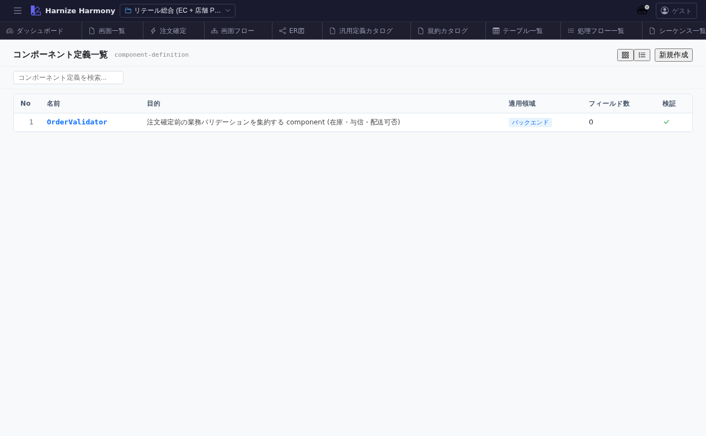

# 汎用定義一覧 (kind 別)

> **対象画面**: `GenericDefinitionListView` (`frontend/src/components/generic-definition/GenericDefinitionListView.tsx`)
> **ルート**: `/w/:wsId/generic-definition/:kind`
> **種別**: マルチインスタンスタブ (kind 単位)

## 概要

汎用定義 (Generic Definition) を 1 つの kind に絞って一覧する。kind は `component-definition` / `constants` / `data-contract` / `domain-event` / `application-rule` / `policy` / `glossary-term` / `rfc` の 8 種。kind ごとに schema / 編集 UI が異なるため、kind 単位でタブを開く設計。

## 到達経路

- 汎用定義カタログ (`/generic-definition`) → 各 kind カードの「一覧へ」
- 直接 URL: `/w/<wsId>/generic-definition/<kind>` (例: `/generic-definition/component-definition`)

## 画面構成

### 主要エリア

1. **ヘッダー** — タイトル「汎用定義: <kind 表示名>」 + 件数 + 「追加」
2. **フィルタ / ソート** — 名前 / 説明検索、更新日時 / 名前ソート
3. **一覧** — 名前 / source (project / extension / framework) / 成熟度 / 説明 / 編集ボタン

## 主要操作

| 操作 | 手段 | 結果 |
|---|---|---|
| 新規追加 | 「追加」 | 新規 GenericDefinitionEditor 新タブ |
| 編集 | 行クリック | `/generic-definition/<kind>/<name>` 新タブ |
| 削除 | 行右クリック → 「削除」 / `Delete` | 参照ありは警告 |
| rename | 右クリック → 「ID 変更…」 / `F2` | RenameEntityDialog (kind 内で unique) |
| カタログへ戻る | パンくず | `/generic-definition` |

## データ前提

- **空状態**: kind 内 0 件、「追加」ボタンで開始
- **意味のある状態**: retail の `component-definition` は `OrderValidator` 1 件、`constants` は `OrderConstants` 1 件

## 関連仕様書

- [`docs/spec/generic-definition-layer.md`](../../spec/generic-definition-layer.md) — 8 kind の意味 / メタモデル
- [`docs/spec/list-common.md`](../../spec/list-common.md)

## 関連 skill

- `/import-md` — markdown 設計書を data-contract / glossary-term 等に一括変換

## 既知の制約・注意

- kind 毎に **必須スキーマ違う** — 別 kind の感覚で編集しないこと
- source `framework` / `extension` の定義は **read-only** (該当パッケージで変更)
