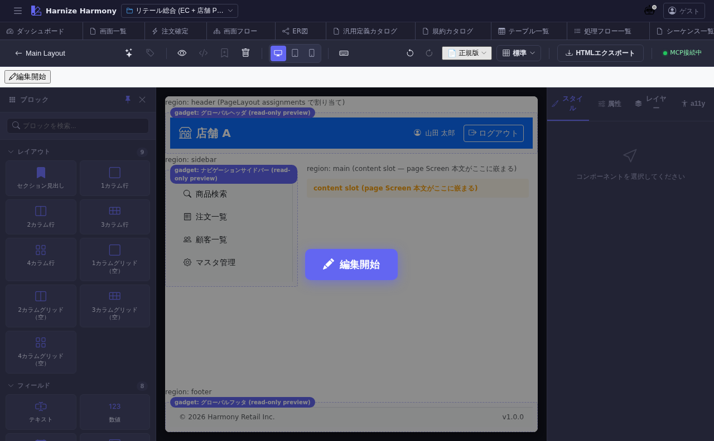

# ページレイアウト Designer

> **対象画面**: `PageLayoutDesigner` (`frontend/src/components/page-layout/PageLayoutDesigner.tsx`)
> **ルート**: `/w/:wsId/page-layout/design/:pageLayoutId`
> **種別**: マルチインスタンスタブ

## 概要

PageLayout の **ビジュアル編集**画面。WYSIWYG で header / sidebar / footer / main-content 等の slot を配置し、各 slot にデフォルトガジェットをドラッグして埋め込む。Screen Designer (GrapesJS / Puck) に似た UX で、レイアウト本体を編集する。

## 到達経路

- ページレイアウト一覧 (`/page-layout/list`) → 行 → 「デザイン」
- ページレイアウト編集 (`/page-layout/edit/:id`) → 「デザインへ」
- 直接 URL: `/w/<wsId>/page-layout/design/<pageLayoutId>`

## 画面構成

### 主要エリア

1. **EditorHeader** — レイアウト名 + 保存 + 「構造編集へ」
2. **左サイドバー** — Gadget Manager (利用可能なガジェット一覧、ドラッグ元)
3. **中央 Canvas** — レイアウトプレビュー (header / sidebar / main / footer 領域を区分表示)
4. **右サイドバー** — 選択中 slot / gadget の設定 (サイズ / position / class 等)

## 主要操作

| 操作 | 手段 | 結果 |
|---|---|---|
| gadget 配置 | 左パレットから Canvas の slot にドラッグ | デフォルトガジェットとして保存 |
| slot サイズ調整 | slot 境界をドラッグ | レスポンシブ breakpoint 毎に保存 |
| gadget 設定 | gadget クリック → 右パネル | props / 表示条件 / class を編集 |
| 構造編集へ | 「構造編集へ」 | `/page-layout/edit/:id` (`PageLayoutEditor`) を新タブ |
| 保存 / 破棄 | `Ctrl+S` / 「破棄」 | edit-session 経由 |

## データ前提

- **空状態**: 何も slot が無いキャンバス → `PageLayoutEditor` で slot を先に定義することを推奨
- **意味のある状態**: retail の `main-layout` は header (ロゴ + ナビ + ユーザーメニュー) + sidebar + main + footer の 4 領域

## 関連仕様書

- [`docs/spec/page-layout.md`](../../spec/page-layout.md) — PageLayout / gadget 仕様
- [`docs/spec/multi-editor-puck.md`](../../spec/multi-editor-puck.md) — Designer の編集モデル共通仕様

## 関連 skill

- なし

## 既知の制約・注意

- **構造 (slot 定義) は `PageLayoutEditor` で先に作る**のが推奨。本 Designer は配置 + 見た目の調整に特化
- gadget は事前に `/gadget/list` で定義済みのもののみ配置可
- レスポンシブ breakpoint (xs/sm/md/lg/xl) 毎に layout が分かれる場合、breakpoint 切替を必ず確認
