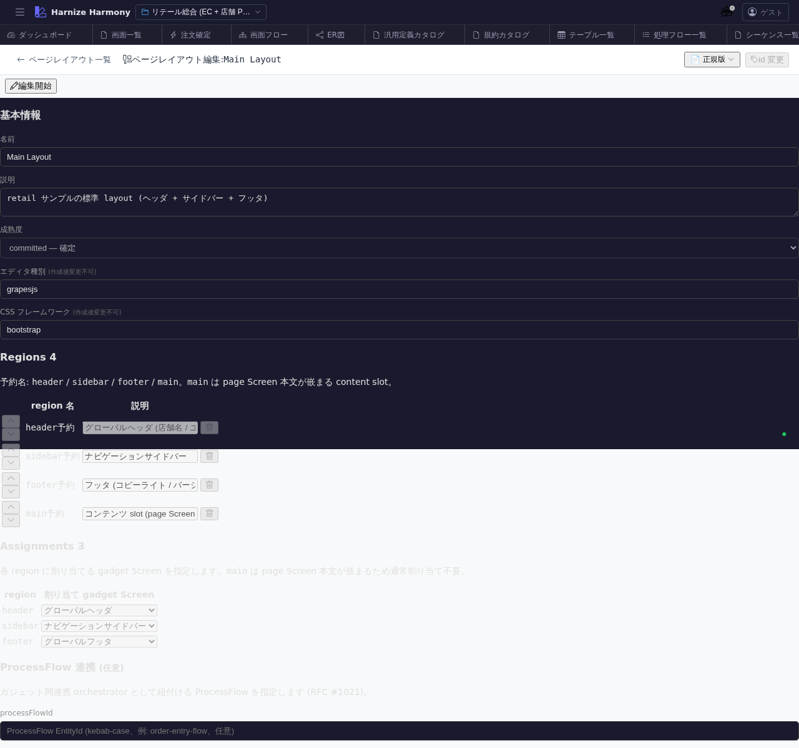

# ページレイアウト編集

> **対象画面**: `PageLayoutEditor` (`frontend/src/components/page-layout/PageLayoutEditor.tsx`)
> **ルート**: `/w/:wsId/page-layout/edit/:pageLayoutId`
> **種別**: マルチインスタンスタブ

## 概要

PageLayout (画面の枠組み) のメタ情報 + スロット (gadget 配置位置) を **構造的に編集**する画面。ビジュアル編集は `PageLayoutDesigner` (`/page-layout/design/:id`) が担当し、本画面はメタデータ + slot 構成の table 編集に特化。

## 到達経路

- ページレイアウト一覧 (`/page-layout/list`) → 行 → 「編集」
- 直接 URL: `/w/<wsId>/page-layout/edit/<pageLayoutId>`

## 画面構成

### 主要エリア

1. **EditorHeader** — レイアウト名 + id 変更 + 保存 + 「デザインへ」ボタン
2. **メタ情報** — 名前 / 論理名 / 説明 / 適用 Screen 数 / 成熟度
3. **slot 一覧** — slot 名 (header / sidebar / footer / dashboard 等) / 配置可能ガジェット数 / デフォルトガジェット / 制約 (1 件のみ / 複数可 等)
4. **適用 Screen 一覧** (read-only) — この PageLayout を使う Screen 一覧 (削除前の影響確認)

## 主要操作

| 操作 | 手段 | 結果 |
|---|---|---|
| slot 追加 | 「slot を追加」 | slot 名 + 制約を指定 |
| slot 編集 | 行クリック | inline でガジェット制約等を編集 |
| デフォルトガジェット設定 | 行のドロップダウン | gadget 一覧 (`/gadget/list`) から選択 |
| ビジュアル編集へ | 「デザインへ」 | `/page-layout/design/:id` を新タブで開く (`PageLayoutDesigner`) |
| 保存 / 破棄 | `Ctrl+S` / 「破棄」 | edit-session 経由 |
| rename | EditorHeader の id 変更 | RenameEntityDialog |

## データ前提

- **新規**: slot 0 件、最低 1 slot (例: main-content) を入れた時点で使い物になる
- **意味のある状態**: retail の `main-layout` は header (ロゴ + ナビ) + sidebar (メニュー) + main-content + footer の 4 slot

## 関連仕様書

- [`docs/spec/page-layout.md`](../../spec/page-layout.md) — PageLayout / gadget / slot 仕様
- [`docs/spec/list-common.md`](../../spec/list-common.md)

## 関連 skill

- なし (構造編集中心、AI 生成 skill は将来検討)

## 既知の制約・注意

- **構造編集 (本画面) と ビジュアル編集 (`page-layout-designer`) は別画面** — 業務的な slot 設計は本画面、見た目の調整は Designer
- gadget 自体の編集は `/gadget/list` → 個別の Designer
- 適用 Screen が 100+ の場合、変更影響範囲が大きいので確認ダイアログ慎重に
