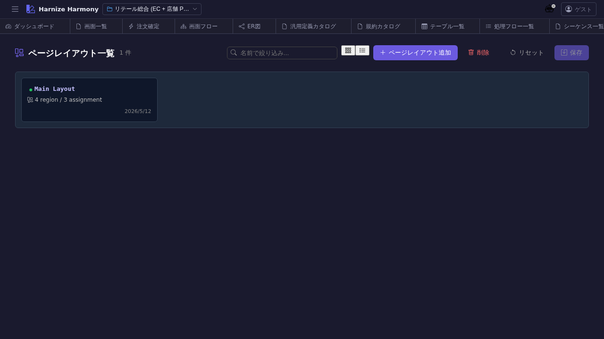

# ページレイアウト一覧

> **対象画面**: `PageLayoutListView` (`frontend/src/components/page-layout/PageLayoutListView.tsx`)
> **ルート**: `/w/:wsId/page-layout/list`
> **種別**: シングルトンタブ

## 概要

ページレイアウト (`PageLayout`) を一覧する。共通ヘッダ / サイドバー / フッタを含む画面の枠組みを定義し、複数 Screen で共有する。RFC #1021 で導入されたモデル E (PageLayout 1 entity + Screen.purpose=gadget) に対応する一覧画面。

## 到達経路

- HeaderMenu → 「ページレイアウト」 → 「一覧」
- 画面一覧 (`/screen/list`) で各 Screen の `pageLayoutId` を選ぶ際の参照元
- 直接 URL: `/w/<wsId>/page-layout/list`

## 画面構成

### 主要エリア

1. **ヘッダー** — タイトル「ページレイアウト一覧」 + 件数 + 「追加」
2. **一覧** — レイアウト名 / gadget 数 / 利用 Screen 数 / 成熟度 / 説明

## 主要操作

| 操作 | 手段 | 結果 |
|---|---|---|
| 新規作成 | 「ページレイアウトを追加」 | `PageLayoutEditor` 新タブ |
| レイアウト編集 | 行クリック → 「編集」 | `/page-layout/edit/:id` (レイアウトパターン + gadget assignment + preview) |
| 削除 | 右クリック → 「削除」 / `Delete` | 利用 Screen ありは警告 |
| rename | 右クリック → 「ID 変更…」 / `F2` | RenameEntityDialog |

## データ前提

- **空状態**: 「ページレイアウトが未登録です」
- **意味のある状態**: retail で `main-layout` (1 件) — ヘッダ + サイドナビ + メインコンテンツの 3 領域

## 関連仕様書

- [`docs/spec/page-layout.md`](../../spec/page-layout.md) — PageLayout 仕様 (#1021)
- [`docs/spec/list-common.md`](../../spec/list-common.md)

## 関連 skill

- なし (直接編集中心、AI 生成 skill は将来検討)

## 既知の制約・注意

- gadget (`Screen.purpose=gadget`) は `/gadget/list` で管理。本画面は **レイアウト本体** のみ
- 複数 PageLayout を持つプロジェクトの場合、Screen 側の `pageLayoutId` で各画面どちらを使うか指定
