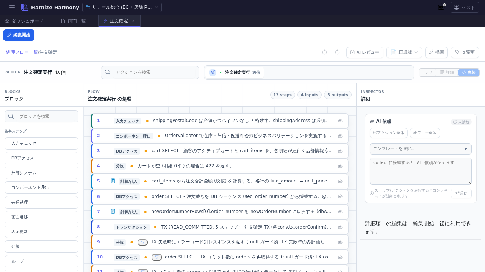

# 処理フロー編集

> **対象画面**: `ProcessFlowEditor` (`frontend/src/components/process-flow/ProcessFlowEditor.tsx`)
> **ルート**: `/w/:wsId/process-flow/edit/:processFlowId`
> **種別**: マルチインスタンスタブ (リソース ID 毎)

## 概要

Harmony の **一次成果物** である処理フロー (ProcessFlow JSON) を、Step / SubStep / Action / Trigger を組み合わせて編集する画面。本プロジェクトは「AI 読み取りが主、JSON Schema が一次」(`feedback_schema_first.md`) の方針で、UI は JSON 表現を可視化・編集する役割。`/create-flow` / `/review-flow` skill とセットで使う。

## 到達経路

- 処理フロー一覧 (`/process-flow/list`) → 行をクリック / 「編集」アクション
- ダッシュボード「処理フロー成熟度」パネル → 個別の flow をクリック
- 直接 URL: `/w/<wsId>/process-flow/edit/<flowId>`

## 画面構成

> Step 詳細展開 / Warnings panel 開状態の追加 screenshot は follow-up で `/document-ui process-flow-editor` を再実行すると `02-step-expanded.png` / `03-warnings-open.png` として生成される (本 PR では default のみ収録、UX 確認用途には十分)。

### 主要エリア

1. **TableSubToolbar** — 上端の補助ツールバー (workspace 切替・ヘルプ等)
2. **EditModeToolbar** — 編集モード切替 (閲覧 / 編集 / コンテキスト) と save / reset
3. **EditorHeader** — タイトル / id 表示 / id 変更ボタン / Codex 連携 / AI コンテキストチップ
4. **メインキャンバス** — Step (`StepCard`) を縦に並べた flow 本体
   - 各 Step は **Action** (`add` / `update` / `compute` / `screenTransition` / `httpRoute` / `ai` 等) と **Trigger** (`onClick` / `onChange` 等) を内包
   - SubStep (loop / branch / try 内の sub flow) を展開できる
   - **D&D による Step 順序入れ替え** (`@dnd-kit`)
5. **PaletteButtons** — Step 種別パレット (画面上部または右側、`ToolbarStepButton`)
6. **WarningsPanel** — 検証結果一覧 (右側折りたたみ式)
7. **AddActionModal** — 「Action 追加」モーダル (Step 内で Action を新規作成)
8. **DrawingOverlay** — Step に紐付くマーカー / 注釈の描画レイヤ (`/designer-work` skill 連携)
9. **ScreenItemPickerModal** — 画面項目を式言語で参照する際の picker

## 主要操作

| 操作 | 手段 | 結果 |
|---|---|---|
| Step 追加 | 上部パレットの種別ボタンをクリック or Step 間の `StepInsertZone` をクリック | `STEP_TEMPLATES` のテンプレで Step が挿入される |
| Step 削除 | Step 右クリック → 「削除」 or `Delete` キー | `clearJumpReferences` で参照を解除して削除 |
| Step 並び替え | Step ヘッダをドラッグ | `@dnd-kit` で並び順変更、保存後に永続化 |
| Step 複製 | 右クリック → 「複製」or `Ctrl+D` | LocalId を採番して clone |
| Action 追加 | Step 内「+」ボタン → `AddActionModal` | trigger / type / outputName 等を入力 |
| SubStep 追加 | loop / branch / try 系 Step 内「+」 | 内側 Step を追加 |
| id 変更 (rename refactor) | EditorHeader の「id 変更」 | `RenameEntityDialog` で kebab-case 新 id を入力、全 ref 自動更新 |
| 編集破棄 | EditModeToolbar の「破棄」 | 確認後サーバ状態に戻す |
| 保存 | `Ctrl+S` or 「保存」 | edit-session 経由でサーバへ commit |
| AI 部分生成 | EditorHeader の AI ボタン (Codex 連携) | `requestProcessFlowPartial` で Codex に部分生成を依頼 |
| 検証結果を開く | 右側 WarningsPanel ヘッダクリック | エラー / 警告一覧、Step / Action にジャンプ可 |
| マーカー追加 | Step 上で右クリック → マーカー追加 | `/designer-work` で Claude Code が処理する指示を残す |

## データ前提

- **空フロー**: Step が 0 件の場合 `EmptyFlowDropZone` が中央に表示され、ここに Step テンプレをドラッグ or パレットから追加
- **典型フロー**: retail サンプルの `process-flows/order-checkout.json` 等は **15-25 Step**、`add` / `update` / `compute` / `screenTransition` / `httpRoute` を含む実用ボリューム
- **検証エラーがある状態**: WarningsPanel に件数表示、Step に warning / error バッジ表示
- **draft 中状態**: edit-session 経由の作業コピーが `data/.drafts/<wsId>/process-flow/<id>.json` に保持される

## 関連仕様書

- [`docs/spec/process-flow-workflow.md`](../../spec/process-flow-workflow.md) — 処理フロー設計の業務フロー
- [`docs/spec/process-flow-variables.md`](../../spec/process-flow-variables.md) — 変数ライフサイクル
- [`docs/spec/process-flow-transaction.md`](../../spec/process-flow-transaction.md) — TX 境界
- [`docs/spec/process-flow-expression-language.md`](../../spec/process-flow-expression-language.md) — 式言語
- [`docs/spec/process-flow-extensions.md`](../../spec/process-flow-extensions.md) — Step / Action 拡張
- [`docs/spec/process-flow-criterion.md`](../../spec/process-flow-criterion.md) — runIf / criterion
- [`docs/spec/process-flow-runtime-conventions.md`](../../spec/process-flow-runtime-conventions.md) — runtime 契約
- [`docs/spec/edit-session-draft.md`](../../spec/edit-session-draft.md) — 明示保存式 + サーバ側 draft 管理

## 関連 skill

- `/create-flow <flowId> <業務概要>` — 処理フロー JSON を AI に新規作成させる (本画面で開いて編集 → 確定)
- `/review-flow <flowId>` — 変数ライフサイクル / TX / runIf / 補償 / event 双方向の 10 観点を専門レビュー
- `/designer-work` — Step マーカー (指示 / 質問 / TODO) を Claude Code に処理させる
- `/generate-code <flowId>` — 処理フロー → backend code 生成 (techStack に基づき Spring Boot / NestJS 系を選択)
- `/generate-tests <flowId>` — 処理フロー → backend e2e test 生成 (jest+supertest)

## 既知の制約・注意

- 一次成果物は **JSON Schema** (`schemas/v3/process-flow.v3.schema.json`)。UI は JSON 表現を編集する派生物に過ぎないため、UI で表現できる範囲は schema 制約に従う
- Schema 拡張は [`docs/spec/schema-governance.md`](../../spec/schema-governance.md) に従い設計者承認必須。UI に「足りない field」を見つけても AI が勝手に schema を変更してはならない
- ProcessFlow の **`ProcessFlow` リネーム**が進行中 (2026-04-25 決定)。当面表記が混在する可能性あり
- AI 部分生成 (Codex 連携) を使うには `.codex/config.toml` の設定 + `/codex:setup` が必要
- 大規模フロー (Step 50+) での D&D は performance に注意。`processFlowMutation` の immutable update で最適化済 (PR #1394)
