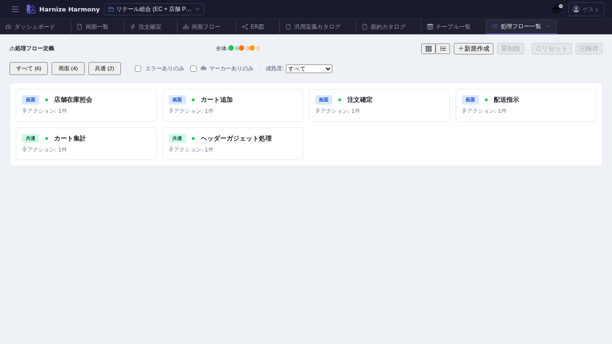

# 処理フロー一覧

> **対象画面**: `ProcessFlowListView` (`frontend/src/components/process-flow/ProcessFlowListView.tsx`)
> **ルート**: `/w/:wsId/process-flow/list`
> **種別**: シングルトンタブ

## 概要

プロジェクトの全処理フロー (ProcessFlow リソース) を一覧する。本プロジェクトの **一次成果物 (JSON Schema)** にあたる処理フローを俯瞰でき、各フローの成熟度 / Step 数 / 検証警告件数 などをカード or 表で確認。`/create-flow` / `/review-flow` / `/generate-code` / `/generate-tests` スキルへの起点となる中央 hub 的画面。

## 到達経路

- HeaderMenu → 「処理フロー」 → 「一覧」
- ダッシュボード「処理フロー成熟度」パネル → 「一覧へ」
- 直接 URL: `/w/<wsId>/process-flow/list`

## 画面構成

### 主要エリア

1. **ヘッダー** — タイトル「処理フロー一覧」 + 件数 + 「処理フローを追加」
2. **フィルタ** — 名前 / namespace / kind (entrypoint / sub / handler) で絞込み
3. **ソート** — 名前 / 成熟度 / Step 数 / 更新日時
4. **一覧** — 各カード/行に成熟度バッジ + 警告件数バッジ + draft マーク (●)

## 主要操作

| 操作 | 手段 | 結果 |
|---|---|---|
| 新規作成 | 「処理フローを追加」 | `ProcessFlowEditor` (`/process-flow/edit/<新規>`) が新タブで開く |
| AI 作成 | (上記後) `/create-flow <flowId> <業務概要>` skill を呼ぶ | AI が品質ガード付きで初期 JSON を生成 |
| フロー編集 | カード / 行クリック | `/process-flow/edit/:id` 新タブ |
| AI レビュー | 右クリック → 「レビュー…」 | `/review-flow <flowId>` skill のヒント表示 |
| 削除 | 右クリック → 「削除」 / `Delete` | 参照ありの場合は警告 |
| rename | 右クリック → 「ID 変更…」 / `F2` | RenameEntityDialog |
| 並び替え | カード / 行ドラッグ | renumber 後保存 |

## データ前提

- **空状態**: 「処理フローが未登録です」+ `/create-flow` skill 案内
- **意味のある状態**: retail で `cart-add` / `order-confirm` / `shipment-dispatch` 等 7 フロー
- draft 中マーク (●) : `data/.drafts/<wsId>/process-flow/<id>.json` 検知時

## 関連仕様書

- [`docs/spec/list-common.md`](../../spec/list-common.md)
- [`docs/spec/process-flow-workflow.md`](../../spec/process-flow-workflow.md) — フロー設計の業務手順
- [`docs/spec/process-flow-maturity.md`](../../spec/process-flow-maturity.md) — 成熟度バッジ判定

## 関連 skill

- `/create-flow <flowId> <業務概要> [namespace]` — 新規作成
- `/review-flow <flowId>` — 10 観点専門レビュー
- `/generate-code <flowId>` / `/generate-tests <flowId>` — code / test 生成

## 既知の制約・注意

- フロー一覧から **直接 trigger 構造を可視化はしない** (Step 詳細は Editor で確認)
- 成熟度フィルタを活用して draft フローと committed フローを切り分けると review しやすい
