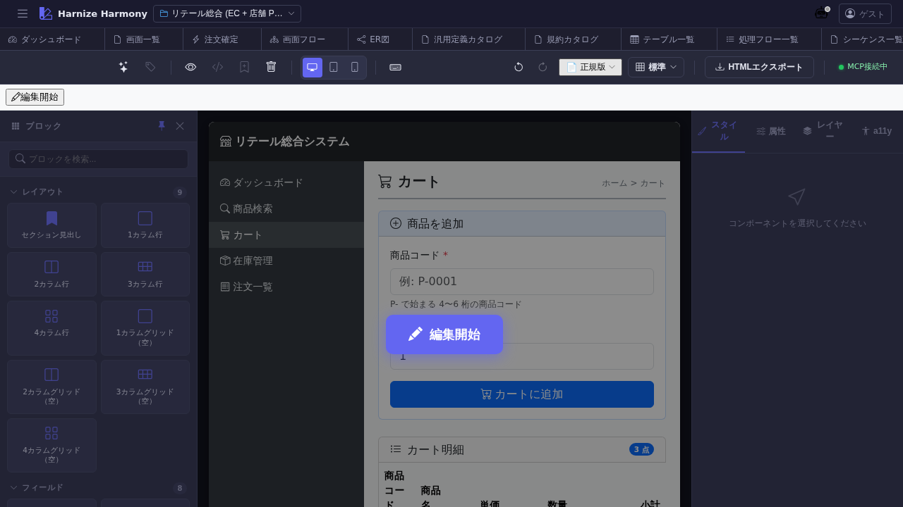

# 画面デザイナー

> **対象画面**: `Designer` (`frontend/src/components/Designer.tsx`、`ResourceLoading` でラップ)
> **ルート**: `/w/:wsId/screen/design/:screenId`
> **種別**: マルチインスタンスタブ (リソース ID 毎)

## 概要

Screen の **ビジュアル編集** を行う画面。GrapesJS (デフォルト) または Puck の 2 エディタを使い分け、画面の HTML 構造 + Bootstrap / Tailwind スタイルを WYSIWYG で組み立てる。60+ pre-built block (`frontend/src/grapes/blocks.ts`) + プロジェクト固有のカスタムブロックを使える。

## 到達経路

- 画面一覧 (`/screen/list`) → カード / 行 ダブルクリック
- 画面フロー (`/screen/flow`) → node ダブルクリック
- 直接 URL: `/w/<wsId>/screen/design/<screenId>`

## 画面構成

### 主要エリア

1. **EditorHeader** — Screen 名 / 編集モード切替 / 保存 / id 変更 / theme 切替 / Puck⇔GrapesJS 切替
2. **左サイドバー (Block Manager)** — Bootstrap / 業務 / カスタムブロックのパレット
3. **中央 Canvas** (iframe) — WYSIWYG プレビュー、ドラッグ&ドロップで配置
4. **右サイドバー (Style Manager / Settings)** — 選択中要素の CSS / 属性 / コンポーネント設定
5. **下部 Layer Tree** — 配置済要素の階層構造、選択 / 再順序

## 主要操作

| 操作 | 手段 | 結果 |
|---|---|---|
| Block 配置 | 左パレット → Canvas にドラッグ | 要素挿入、autosave で workspace の `screens/{id}.design.json` に永続化 |
| 要素選択 | Canvas または Layer Tree でクリック | 右サイドバーが該当要素の設定に切替 |
| スタイル変更 | 右 Style Manager で CSS 編集 | inline style として書込み |
| theme 切替 | EditorHeader → Theme dropdown | standard / card / compact / dark の CSS 切替 |
| editor 切替 | EditorHeader → editorKind dropdown | GrapesJS ⇔ Puck (同 Screen を両エディタで開ける、選択値が project default 上書き) |
| マーカー追加 | Canvas 上で右クリック → 「マーカー」 | `/designer-work` で AI 指示として処理可 |
| カスタムブロック保存 | 左パレット → 選択要素を「Block にコピー」 | `custom-blocks.json` に保存、再利用可 |
| 保存 | `Ctrl+S` or autosave | edit-session 経由でサーバ反映 |

## データ前提

- **空画面**: Canvas が真っ白、左の Block Manager から要素をドラッグして組み立て
- **意味のある画面**: retail の `cart` 等は Bootstrap ベースの商品カート画面が既に配置されている

## 関連仕様書

- [`docs/spec/multi-editor-puck.md`](../../spec/multi-editor-puck.md) — Puck/GrapesJS 共存仕様 (#806)
- [`docs/user-guide/multi-editor-puck-guide.md`](../multi-editor-puck-guide.md) — Puck/GrapesJS 使い分けガイド
- [`docs/spec/css-framework-switching.md`](../../spec/css-framework-switching.md) — Bootstrap/Tailwind 切替

## 関連 skill

- `/designer-work <processFlowId>` — マーカー (Canvas 上の指示書き) を Claude Code が読んで処理フローを編集
- `/rename-screen-ids` — Canvas 内 input/button の自動採番 id を業務名にリネーム

## 既知の制約・注意

- **iframe Canvas は a11y tree に出ない** — 本マニュアルの screenshot だけでは内部要素を読めない、実機で操作必須
- WebSocket 切断時は **localStorage fallback** (`gjs-screen-{id}`)、復帰後 sync (`docs/spec/workspace.md` 参照)
- GrapesJS / Puck の切替時は **未保存変更があると確認ダイアログ**
- `purpose='gadget'` のガジェット編集も同 Designer を使う (viewport だけ小さくなる)
