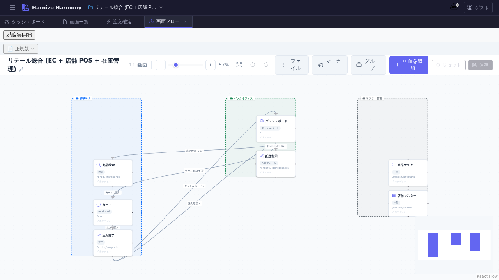

# 画面フロー図

> **対象画面**: `FlowEditor` (`frontend/src/components/flow/FlowEditor.tsx`)
> **ルート**: `/w/:wsId/screen/flow`
> **種別**: シングルトンタブ

## 概要

プロジェクト全画面の遷移関係を **ReactFlow キャンバス**で可視化・編集する画面。画面 (Screen) を node、遷移 (edge) を線で結び、業務全体のユーザー導線を俯瞰する。node 位置は `screen-flow-positions.json` に永続化される。

## 到達経路

- HeaderMenu → 「画面」→ 「画面フロー」
- ダッシュボード等から画面遷移パネル経由
- 直接 URL: `/w/<wsId>/screen/flow`

## 画面構成

### 主要エリア

1. **ヘッダーツールバー** — 「画面追加」「保存」「リセット」 + 検証バッジ
2. **ReactFlow キャンバス** — ズーム / パン操作可、Screen node + edge を描画
   - 各 node は ScreenKind に応じたアイコン + 画面名 + URL 表示
   - edge は遷移種別 (navigate / submit / replace 等) を色で区別
3. **MiniMap / Controls** — 右下、キャンバス全体の navigator + zoom +/-
4. **検証 / 警告パネル** — error / warning を持つ node がハイライト

## 主要操作

| 操作 | 手段 | 結果 |
|---|---|---|
| 画面追加 | 「画面追加」ボタン | 新規 Screen が原点付近に配置される |
| node 移動 | node をドラッグ | 位置を `screen-flow-positions.json` に保存 |
| 画面デザイナーを開く | node をダブルクリック | `/screen/design/:id` が新タブで開く |
| 遷移 (edge) 追加 | node の handle 同士をドラッグで接続 | 新規 edge 作成、遷移種別はモーダルで選択 |
| edge 削除 | edge を選択 → `Delete` | 該当遷移が削除される |
| ズーム | マウスホイール / ctrl+scroll | canvas zoom in/out |
| 全体表示 | 右下 Controls の「Fit View」 | 全 node が画面に収まるよう自動配置 |
| 保存 | 「保存」 or `Ctrl+S` | レイアウト + 追加 / 削除を sync |

## データ前提

- **空状態**: 中央に「画面が未登録です」プレースホルダ
- **意味のある状態**: retail サンプルでは商品検索 → カート → 注文確定 → 配送指示の主要 4 シナリオが edge で繋がれる
- node 位置情報は workspace の `harmony/screen-flow-positions.json` で永続化 (削除すると初期配置にリセット)

## 関連仕様書

- [`docs/spec/workspace.md`](../../spec/workspace.md) — `screen-flow-positions.json` の保存先と path 規約

## 関連 skill

- `/create-flow <flowId>` — 画面遷移トリガが処理フローと連携する場合の作成 skill (`/process-flow/edit/:id` 参照)

## 既知の制約・注意

- ReactFlow の D&D は **静的 screenshot で操作説明が薄くなる**点に注意。本マニュアルでは基本操作のみカバーし、複雑なレイアウト変更は実機で慣れること推奨
- 1000+ 画面規模での描画 perf は ReactFlow の virtualization 任せ。retail サンプル規模 (11 画面) では問題なし
- node 位置は `localStorage` ではなく **workspace 内 file** に保存されるため、別 PC でも同じレイアウトが見える
