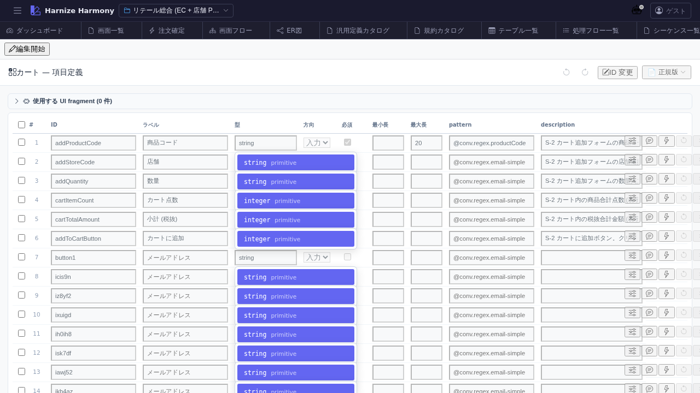

# 画面項目編集

> **対象画面**: `ScreenItemsView` (`frontend/src/components/screen-items/ScreenItemsView.tsx`)
> **ルート**: `/w/:wsId/screen/items/:screenId`
> **種別**: マルチインスタンスタブ

## 概要

Screen 内の各 **項目 (input / button / link / display 等)** を構造的に編集する。Designer で配置した要素を「画面項目」という業務レベルで扱い、ID / ラベル / 種別 / 入力検証 / 表示条件 / イベント (trigger) などを定義する。`/process-flow/edit/:id` で参照される `screen.item.{id}` の発生源。

## 到達経路

- 画面一覧 (`/screen/list`) → カード上の「項目定義」アイコン
- Designer (`/screen/design/:id`) → 「項目定義へ」ボタン
- 直接 URL: `/w/<wsId>/screen/items/<screenId>`

## 画面構成

### 主要エリア

1. **EditorHeader** — 「画面項目: <Screen 名>」+ 保存 / 破棄 / id 変更
2. **項目一覧表** — 列: 順番 / ID / 表示名 / 種別 (input/button/display/select/checkbox/link/file 等) / 必須 / 検証ルール / 説明
3. **編集パネル** — 行選択で詳細編集 (initial value / placeholder / event trigger 等)
4. **検証状態** — 共通規約違反 / 未参照項目 のサマリ

## 主要操作

| 操作 | 手段 | 結果 |
|---|---|---|
| 項目追加 | 「項目を追加」 / 表内のリネームから | 行追加 |
| ID 自動命名 | 「AI で命名」 (項目選択後) | `/rename-screen-ids` skill 連携で AI 推論名を提案 |
| 編集 | 行クリック | 右パネルで詳細編集 |
| 並び替え | 行ドラッグ | 表示順 = 業務順 (Tab key 移動順に影響) |
| 削除 | 右クリック → 「削除」 / `Delete` | process-flow 参照ありは警告 |
| rename refactor | 行右クリック → 「ID 変更…」 | RenameEntityDialog (画面内のみ unique) |
| 検証 | autosave 後 | warning / error バッジ表示 |

## データ前提

- **空状態**: 「項目が未定義」プレースホルダ。Designer で配置した部品から自動採番 (`item-1` 等) で初期化される場合あり
- **意味のある状態**: retail の `cart` は商品行 / 数量 / 削除ボタン / 小計 / 「注文へ進む」ボタン 等の項目で構成

## 関連仕様書

- [`docs/spec/screen-items.md`](../../spec/screen-items.md) — 画面項目の責務 / 種別一覧 / 検証ルール
- [`docs/spec/list-common.md`](../../spec/list-common.md)

## 関連 skill

- `/rename-screen-ids` — 自動採番 ID を業務名に一括リネーム

## 既知の制約・注意

- **Designer (canvas) と本画面で項目集合が一致するとは限らない** — Designer 側で要素を追加しただけだと項目定義が未生成のことあり (今後 sync 改善検討)
- 画面項目 ID は **画面内で unique**、process-flow からは `screen.item.<id>` で参照
- 検証ルール変更時は process-flow 側の条件分岐への影響を必ず確認
