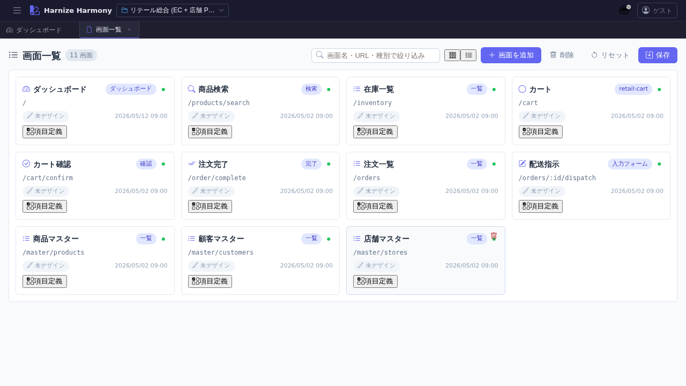
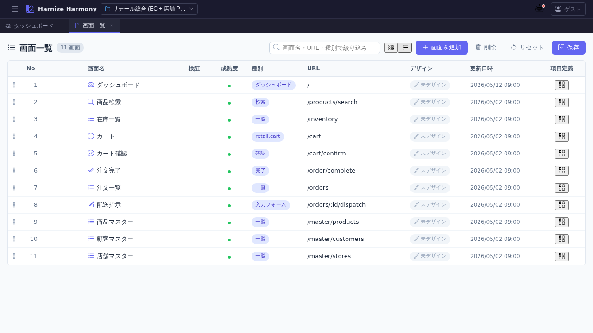

# 画面一覧

> **対象画面**: `ScreenListView` (`frontend/src/components/flow/ScreenListView.tsx`)
> **ルート**: `/w/:wsId/screen/list`
> **種別**: シングルトンタブ

## 概要

プロジェクトの全画面 (Screen リソース) を一覧する。カード / 表の 2 表示モード切替、フィルタ、ソート、複数選択、コピー / 切り取り / 貼り付け、ID 変更 (rename refactor)、ドラフト中マークの可視化など、一覧 UI 共通仕様 ([`list-common`](../../spec/list-common.md)) を全部備える代表的な画面。

`purpose='gadget'` の画面は本一覧では非表示 (ガジェット一覧 `/gadget/list` で管理、#1025)。

## 到達経路

- HeaderMenu → 「画面」→「画面一覧」
- ダッシュボード「機能別定義数」パネル → 「画面」リンク
- 直接 URL: `/w/<wsId>/screen/list`

## 画面構成

<!-- TODO: /document-ui screen-list 実行時に上記 2 枚を生成 -->

### 主要エリア

1. **ヘッダー** — タイトル「画面一覧」+ 「新規作成」ボタン
2. **フィルタバー** (`FilterBar`) — キーワード検索 (画面名 / URL / 説明)
3. **ソートバー** (`SortBar`) — 画面名 / 種別 / URL / 更新日時 で昇降順
4. **表示モード切替** (`ViewModeToggle`) — カード ⇔ 表
5. **一覧本体** (`DataList`)
   - **カードビュー** — グリッド上に画面アイコン + 名前 + 種別 + バッジ群
   - **表ビュー** — 列: draft●(未保存マーク) / 画面名 / 検証(error/warning 件数) / 成熟度 / 種別 / URL / 更新日時

## 主要操作

| 操作 | 手段 | 結果 |
|---|---|---|
| 新規作成 | 右上「新規作成」 or 右クリック → 「新規作成」 | `ScreenEditModal` が開き、名前 / 種別 / URL / pageLayoutId / editorKind / cssFramework を入力 |
| 画面を開く | カード / 行をクリック | 画面デザイナー (`/screen/design/:id`) が新タブで開く |
| 画面項目編集を開く | カード上の「画面項目」アイコン or 表内のアイコン | `/screen/items/:id` が新タブで開く |
| 編集 (メタ情報) | 右クリック → 「編集」 or `F2` | `ScreenEditModal` (既存値で開く) |
| 削除 | 右クリック → 「削除」 or `Delete` キー | デザインデータと edges も削除、確認ダイアログあり |
| 複数選択 | Ctrl+Click / Shift+Click | カード / 行に選択枠 |
| コピー / 切り取り / 貼り付け | `Ctrl+C` / `Ctrl+X` / `Ctrl+V` | 別 workspace へも貼り付け可 |
| 複製 | 右クリック → 「複製」 or `Ctrl+D` | 同名末尾に番号付きで複製 |
| ID 変更 (rename refactor) | 右クリック → 「ID 変更…」 | `RenameEntityDialog` で kebab-case 新 id を入力、全 ref 自動更新 + undo toast |
| 並び替え | カード / 行をドラッグ | `renumber()` で No 列再採番、save 必要 |
| ソート | ソートバー or 表のヘッダクリック | 表示順のみ変わる (永続化されない) |
| フィルタ | キーワード入力 | 部分一致で絞込み |
| カード ⇔ 表切替 | 右上の切替ボタン | localStorage (`list-view-mode:screen-list`) に永続化 |
| 保存 | `Ctrl+S` or 「保存」ボタン (編集中のみ表示) | `commitScreens` でサーバ反映 |
| 編集破棄 | 「破棄」ボタン (編集中のみ) | 確認後サーバの状態に戻す |

## データ前提

- **空状態**: 「画面が未登録です」プレースホルダ + 「新規作成」ボタンのみ
- **意味のある状態**: retail サンプル等の場合、各 ScreenKind (page / dialog / partial 等) の画面が混在表示、`MaturityBadge` (draft / committed) や `ValidationBadge` (error / warning 件数) が情報量を増やす
- **ドラフト中状態**: `useDraftRegistry` で `data/.drafts/<wsId>/screen/<id>.json` 存在検知 → 1 列目に `●` マーク

## 関連仕様書

- [`docs/spec/list-common.md`](../../spec/list-common.md) — 一覧 UI 共通仕様 (本画面が典型)
- [`docs/spec/draft-state-policy.md`](../../spec/draft-state-policy.md) — `MaturityBadge` / `ValidationBadge` の判定基準
- [`docs/spec/multi-editor-puck.md`](../../spec/multi-editor-puck.md) — `editorKind` (grapesjs / puck) の選択意義
- [`docs/spec/page-layout.md`](../../spec/page-layout.md) — `pageLayoutId` (ページレイアウト) の役割

## 関連 skill

- `/rename-screen-ids` — 画面項目 ID を AI 推論で一括 rename (本画面の rename refactor とは別、項目側)

## 既知の制約・注意

- ソート結果は **表示順のみ**で永続化されない。並び順を変えたい場合はカード / 行をドラッグ
- `purpose='gadget'` の画面は本一覧に出ない。ガジェット一覧で管理
- カード / 表の切替は localStorage 永続化なので、ブラウザ / PC 毎にユーザー設定が分かれる
