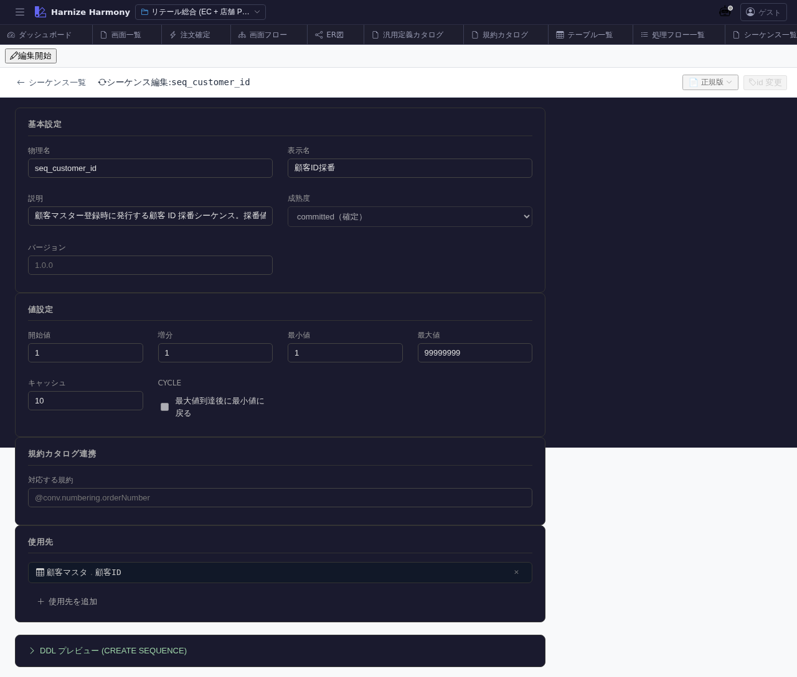

# シーケンス編集

> **対象画面**: `SequenceEditor` (`frontend/src/components/sequence/SequenceEditor.tsx`)
> **ルート**: `/w/:wsId/sequence/edit/:sequenceId`
> **種別**: マルチインスタンスタブ

## 概要

DB シーケンス (採番) 1 件を編集する。開始値 / 増分 / フォーマット (prefix / 桁数 / suffix / 区切り) / 説明を設定し、process-flow の `nextSeq(...)` 呼出時に取得される値の形を決める。

## 到達経路

- シーケンス一覧 (`/sequence/list`) → 行クリック
- 直接 URL: `/w/<wsId>/sequence/edit/<sequenceId>`

## 画面構成

### 主要エリア

1. **EditorHeader** — シーケンス名 + id 変更 + 保存
2. **基本情報** — 名前 / 論理名 / 説明 / 成熟度
3. **採番設定** — 開始値 / 増分 / cycle 可否 / cache 数 / 最大値
4. **フォーマット** — prefix (例: `CUST-`) / 桁数 (例: 6) / suffix / preview (例: `CUST-000001`)

## 主要操作

| 操作 | 手段 | 結果 |
|---|---|---|
| 開始値 / 増分編集 | フォームフィールド | inline 編集 |
| フォーマット preview | リアルタイム | preview 行で現在設定の出力例を表示 |
| 保存 / 破棄 | `Ctrl+S` / 「破棄」 | edit-session 経由 |
| rename | EditorHeader の id 変更 | RenameEntityDialog |

## データ前提

- **新規**: 空フォーム、最低開始値 + 増分を入れる
- **意味のある状態**: retail の `customer-id-sequence` は開始 1 / 増分 1 / prefix `CUST-` / 桁数 6 → `CUST-000001` から始まる

## 関連仕様書

- [`docs/spec/process-flow-expression-language.md`](../../spec/process-flow-expression-language.md) — `nextSeq(<sequence-id>)` 関数

## 関連 skill

- `/generate-code` — techStack に基づき `CREATE SEQUENCE` DDL or app-level counter を生成

## 既知の制約・注意

- 既存シーケンスを **開始値リセット**しても、DB の current value は別途 `ALTER SEQUENCE` で操作する必要
- `nextSeq()` を呼ぶフローが既に動いている本番では、増分変更は影響大なので注意
