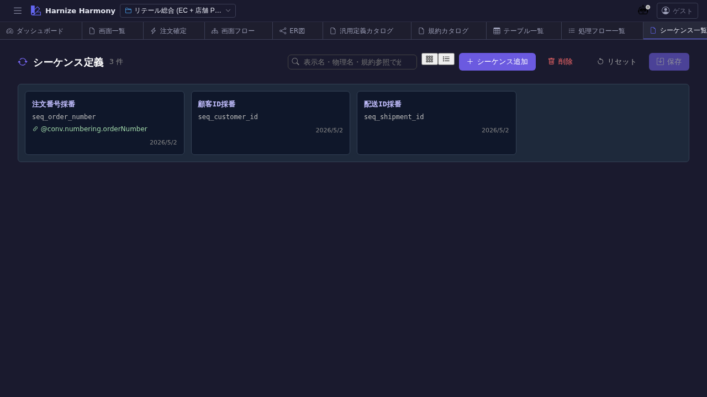

# シーケンス一覧

> **対象画面**: `SequenceListView` (`frontend/src/components/sequence/SequenceListView.tsx`)
> **ルート**: `/w/:wsId/sequence/list`
> **種別**: シングルトンタブ

## 概要

DB シーケンス (採番) 定義を一覧する。`order-number-sequence` / `customer-id-sequence` のような、業務的に意味を持つ ID 体系 (請求番号 / 顧客 ID / 出荷番号 等) を framework 横断で集約する画面。SQL の `CREATE SEQUENCE` に直結する。

## 到達経路

- HeaderMenu → 「シーケンス」 → 「一覧」
- 直接 URL: `/w/<wsId>/sequence/list`

## 画面構成

### 主要エリア

1. **ヘッダー** — タイトル「シーケンス一覧」 + 件数 + 「追加」
2. **一覧** — シーケンス名 / 開始値 / 増分 / フォーマット (prefix / 桁数 / suffix) / 説明

## 主要操作

| 操作 | 手段 | 結果 |
|---|---|---|
| 新規作成 | 「シーケンスを追加」 | `SequenceEditor` 新タブ |
| 編集 | 行クリック | `/sequence/edit/:id` 新タブ |
| 削除 | 右クリック → 「削除」 / `Delete` | process-flow 等の `nextSeq()` 参照ありは警告 |
| rename | 右クリック → 「ID 変更…」 / `F2` | RenameEntityDialog |
| ソート / フィルタ | ヘッダクリック / フィルタバー | 名前 / 開始値 / 更新日時 |

## データ前提

- **空状態**: 「シーケンスが未登録です」
- **意味のある状態**: retail で `customer-id-sequence` / `order-number-sequence` / `shipment-id-sequence` の 3 件

## 関連仕様書

- [`docs/spec/list-common.md`](../../spec/list-common.md)
- 処理フロー内の `nextSeq()` 呼出は [`process-flow-expression-language.md`](../../spec/process-flow-expression-language.md) 参照

## 関連 skill

- `/generate-code` — techStack に基づき `CREATE SEQUENCE` DDL や app code を生成

## 既知の制約・注意

- シーケンス参照 (`nextSeq()`) を含むフローが残ったまま削除すると **runtime エラー**になるため、削除時の警告は必ず確認
- フォーマット (prefix / suffix / zero-pad 桁数) は schema で定義、表示時に combined preview を見せる
