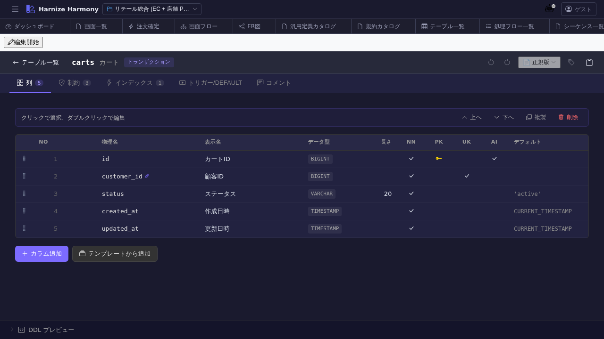

# テーブル定義編集

> **対象画面**: `TableEditor` (`frontend/src/components/table/TableEditor.tsx`)
> **ルート**: `/w/:wsId/table/edit/:tableId`
> **種別**: マルチインスタンスタブ

## 概要

テーブル (Table) の **カラム定義 / インデックス / 外部キー / 制約** を編集する。DDL 生成 (`/generate-code`) / ER 図 (`/table/er`) の入力となる中核画面。一覧 UI 共通仕様準拠で、カラムも `useListSort` / `useListFilter` / 並び替え可能。

## 到達経路

- テーブル一覧 (`/table/list`) → カード / 行クリック
- ER 図 (`/table/er`) → エンティティクリック (将来)
- 直接 URL: `/w/<wsId>/table/edit/<tableId>`

## 画面構成

### 主要エリア

1. **EditorHeader** — テーブル名 + id 変更 + 保存 + 編集モード
2. **メタ情報** — 名前 / 物理名 / 説明 / 成熟度
3. **カラム一覧** (`DataList`) — 列: 順番 / 物理名 / 論理名 / 型 / NULL 可 / デフォルト / PK / FK / index / 説明
4. **外部キー / インデックス** タブ (折りたたみ)
5. **検証状態** — schema 違反 / 未参照 / 命名規約違反

## 主要操作

| 操作 | 手段 | 結果 |
|---|---|---|
| カラム追加 | 「カラム追加」 | 末尾に新規行、inline 編集 |
| カラム編集 | 行のセルクリック | inline 編集モード |
| FK 追加 | 「外部キー」タブ → 「追加」 | 参照テーブル / カラム選択 |
| Index 追加 | 「インデックス」タブ → 「追加」 | 対象カラム / unique / 名前を指定 |
| カラム並び替え | 行ドラッグ | renumber |
| カラム削除 | 行右クリック → 「削除」 / `Delete` | 参照ありは警告 |
| rename refactor | 右クリック → 「ID 変更…」 / `F2` | RenameEntityDialog |
| 保存 / 破棄 | `Ctrl+S` / 「破棄」 | edit-session 経由 |

## データ前提

- **空状態**: カラム 0 件、最低 1 カラム (主キー) を入れた時点で意味を持つ
- **意味のある状態**: retail の `cart` テーブルは `id` (PK) / `customer_id` (FK) / `created_at` / `updated_at` 等

## 関連仕様書

- [`docs/spec/list-common.md`](../../spec/list-common.md) — カラム一覧の共通 UI
- [`docs/spec/schema-design-principles.md`](../../spec/schema-design-principles.md) — テーブル / カラム命名規約

## 関連 skill

- `/generate-code` — DDL / migration / repository を techStack に従い生成
- (将来) `/review-table` — テーブル定義の品質レビュー

## 既知の制約・注意

- **物理名と論理名は別管理**。`generate-code` は physical name、UI は logical name 表示
- 大規模テーブル (100+ カラム) でも仮想スクロール対応済
- FK 削除時の波及 (parent 側の cascade) は **手動指定** (ON DELETE CASCADE 等)
