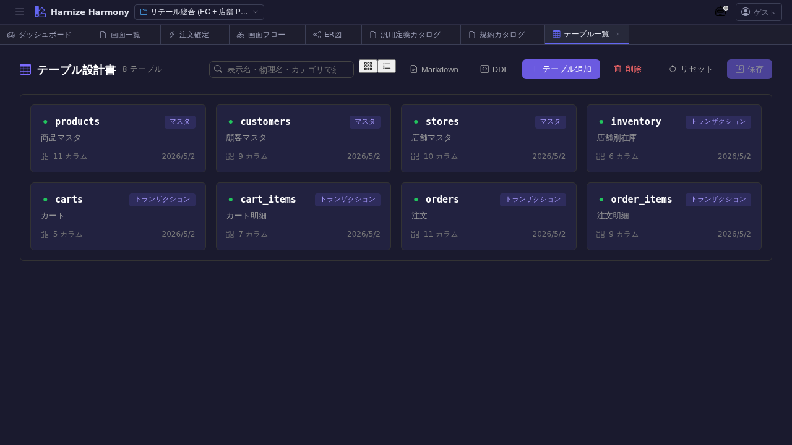

# テーブル一覧

> **対象画面**: `TableListView` (`frontend/src/components/table/TableListView.tsx`)
> **ルート**: `/w/:wsId/table/list`
> **種別**: シングルトンタブ

## 概要

プロジェクトの全テーブル (Table リソース) を一覧する。`docs/spec/list-common.md` 準拠の共通 UI (カード / 表切替、フィルタ、ソート、複数選択、コピペ、rename refactor) を備える。テーブル定義 → DDL 生成 / ER 図に直結する基盤データの管理画面。

## 到達経路

- HeaderMenu → 「テーブル」 → 「一覧」
- ダッシュボード「機能別定義数」パネル → 「テーブル」リンク
- ER 図画面のエンティティクリック
- 直接 URL: `/w/<wsId>/table/list`

## 画面構成

### 主要エリア

1. **ヘッダー** — タイトル「テーブル一覧」 + 件数 + 「テーブルを追加」ボタン
2. **フィルタバー** — テーブル名 / カラム名 / 説明部分一致
3. **ソートバー** — 名前 / 更新日時 / 成熟度
4. **表示モード切替** — カード ⇔ 表
5. **一覧本体** — テーブル毎にカラム数 / FK 数 / 成熟度バッジ表示

## 主要操作

| 操作 | 手段 | 結果 |
|---|---|---|
| 新規作成 | 「テーブルを追加」 | `TableEditor` (`/table/edit/<新規 id>`) が新タブで開く |
| テーブル編集 | カード / 行クリック | `/table/edit/:id` 新タブ |
| ER 図で位置確認 | 右クリック → 「ER で表示」 | `/table/er` を開き該当エンティティをハイライト (将来) |
| 削除 | 右クリック → 「削除」 / `Delete` | FK 参照ありの場合は警告 |
| 並び替え | カード / 行ドラッグ | `renumber()` で No 列再採番 |
| rename refactor | 右クリック → 「ID 変更…」 / `F2` | `RenameEntityDialog` で kebab-case 新 id を入力、全 ref 自動更新 |
| 保存 / 破棄 | `Ctrl+S` / 「破棄」 | edit-session 経由でサーバ反映 |

## データ前提

- **空状態**: 「テーブルが未登録です」プレースホルダ
- **意味のある状態**: retail で Cart / CartItem / Customer / Inventory / Order / OrderItem / Product 等 10+ テーブル

## 関連仕様書

- [`docs/spec/list-common.md`](../../spec/list-common.md) — 一覧共通仕様
- [`docs/spec/draft-state-policy.md`](../../spec/draft-state-policy.md) — 成熟度バッジの判定

## 関連 skill

- `/generate-code` — techStack に基づき DDL / repository / migration を生成

## 既知の制約・注意

- カラム単位の編集は `TableEditor` で行う (本一覧は一覧レベル)
- 大規模スキーマ (100+ テーブル) では fold / フィルタを多用すること
