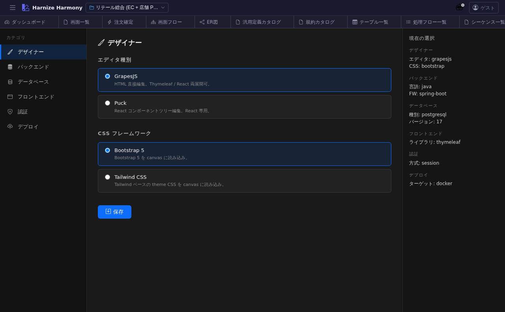

# 技術スタック選定

> **対象画面**: `TechStackView` (`frontend/src/components/project/TechStackView.tsx`)
> **ルート**: `/w/:wsId/project/tech-stack`
> **種別**: シングルトンタブ

## 概要

プロジェクトが生成するコードの **技術スタック** を選定する画面。backend (Spring Boot / NestJS 等) / frontend (Next.js / React / Thymeleaf 等) / DB (PostgreSQL / MySQL / Oracle 等) / DDL 管理ツール (Flyway / Liquibase / Prisma 等) / CSS framework (Bootstrap / Tailwind) などを project 単位で設定し、`/generate-code` スキルがこの設定に基づき適切な雛形を生成する。

## 到達経路

- HeaderMenu → 「プロジェクト」 → 「技術スタック」
- 直接 URL: `/w/<wsId>/project/tech-stack`

## 画面構成

### 主要エリア

1. **ヘッダー** — タイトル「技術スタック」 + 保存
2. **backend グループ** — language / framework / persistence / migration
3. **frontend グループ** — framework / state management / CSS / designer kind (GrapesJS / Puck)
4. **DB / インフラ** — DB engine / connection / 監視
5. **AI / 開発支援** — Codex / Claude Code 設定 (AI 連携時の prompt 等)

## 主要操作

| 操作 | 手段 | 結果 |
|---|---|---|
| stack 選択 | 各カテゴリの dropdown | `harmony.json` の `techStack` に保存 |
| 排他制約の警告 | 自動 | 例: backend=Spring + persistence=Prisma 等の不整合組合せに warning |
| 保存 | 「保存」 / `Ctrl+S` | `harmony.json` 更新 |
| recommended preset | 「推奨組合せ」 | 典型 stack (例: nestjs+nextjs+prisma+postgresql) をワンクリック適用 |

## データ前提

- **新規 project**: 全フィールド空 → 「推奨組合せ」から開始すると速い
- **意味のある状態**: retail は Spring Boot + Thymeleaf + Flyway + Postgres + Bootstrap の典型業務系 stack

## 関連仕様書

- `harmony.json` schema の `techStack` field — [`docs/spec/sample-project-structure.md`](../../spec/sample-project-structure.md)
- [`docs/spec/code-generation.md`](../../spec/code-generation.md) — techStack の使われ方
- [`docs/user-guide/generate-code-workflow.md`](../generate-code-workflow.md) — 生成ワークフロー

## 関連 skill

- `/generate-code <flowId|screenId>` — techStack に基づき backend / frontend code を生成
- `/generate-tests <flowId|screenId>` — techStack に基づき test code を生成

## 既知の制約・注意

- techStack は **後から変更可**だが、既に生成済 code との整合を取るには `/generate-code` を再実行する必要
- 推奨組合せに無い stack 組合せ (例: Spring + Prisma) を選ぶ場合は **手動補完が必要**な箇所が出る可能性あり
- AI 連携設定の codex は `.codex/config.toml` と project レベル設定の合成
