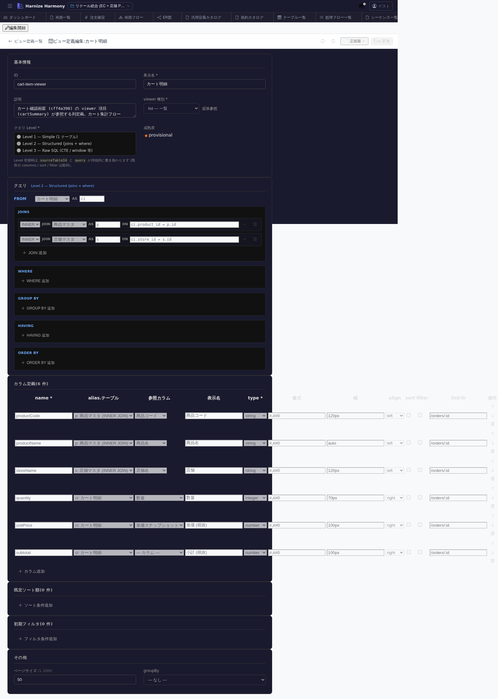

# ViewDefinition 編集

> **対象画面**: `ViewDefinitionEditor` (`frontend/src/components/view-definition/ViewDefinitionEditor.tsx`)
> **ルート**: `/w/:wsId/view-definition/edit/:viewDefinitionId`
> **種別**: マルチインスタンスタブ

## 概要

ViewDefinition (画面表示用 projection) を 1 件編集する。一覧画面の列定義 / 明細画面の表示項目 / 検索結果のフォーマットなど、**UI 側で必要な data shape** を定義する。`View` (DB ビュー) とは別レイヤ。

## 到達経路

- ViewDefinition 一覧 (`/view-definition/list`) → 行クリック
- 画面項目編集 (`/screen/items/:id`) で項目の `presentation.viewDefinitionId` を選んだ際の編集ジャンプ
- 直接 URL: `/w/<wsId>/view-definition/edit/<viewDefinitionId>`

## 画面構成

### 主要エリア

1. **EditorHeader** — 名前 + id 変更 + 保存
2. **基本情報** — 名前 / source (table or view) / 用途 (list / detail / form / dropdown 等) / 説明
3. **項目定義** (列) — 表示順 / 項目名 / source field / ラベル / 表示形式 (currency / date / link 等) / sortable / filterable
4. **デフォルト sort / filter** — 初期状態の並び / 検索条件

## 主要操作

| 操作 | 手段 | 結果 |
|---|---|---|
| 項目追加 | 「項目を追加」 | source field 選択 (table カラム or 計算式) |
| 項目並び替え | 行ドラッグ | 画面での列順序に直結 |
| 表示形式設定 | 行のセルクリック | currency / date / link / image 等から選択 |
| デフォルト sort | 「ソート設定」 | 1 つ以上の field で初期 sort |
| 保存 / 破棄 | `Ctrl+S` / 「破棄」 | edit-session 経由 |
| rename | EditorHeader の id 変更 | RenameEntityDialog |

## データ前提

- **新規**: source 0 件、最低 source + 1 項目で意味
- **意味のある状態**: retail の `cart-item-viewer` は cart-item テーブルから 商品名 / 数量 / 単価 / 小計 / 削除リンク を投影

## 関連仕様書

- [`docs/spec/view-definition.md`](../../spec/view-definition.md) — 仕様 / 用途別フィールド集合
- [`docs/spec/draft-state-policy.md`](../../spec/draft-state-policy.md) — schema 違反保存可

## 関連 skill

- `/generate-code` — `react`/`nextjs` techStack で本 ViewDefinition から table / list component を自動生成

## 既知の制約・注意

- ViewDefinition は **UI 視点の projection** で、SQL 視点の DB ビュー (`view-editor`) とは別物
- source に DB ビューを指定すれば「DB ビュー → ViewDefinition → 画面 component」の 3 段重ね可能
- 用途 (list / detail / form / dropdown) ごとに **必須項目集合が異なる**ため、用途変更時は項目を再確認
