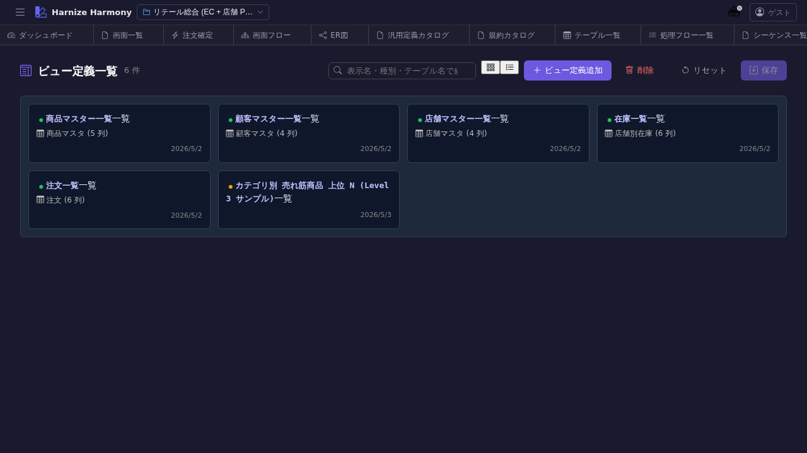

# ViewDefinition 一覧

> **対象画面**: `ViewDefinitionListView` (`frontend/src/components/view-definition/ViewDefinitionListView.tsx`)
> **ルート**: `/w/:wsId/view-definition/list`
> **種別**: シングルトンタブ

## 概要

ViewDefinition (viewer) — **画面表示用の projection 定義** を一覧する。テーブル / DB ビューを画面に投影する際の項目選択 / 並び順 / 条件 / ラベル整形などを扱う中間層 (検索結果一覧の列定義、明細表の表示項目 等)。DB 層の View (`view-list`) とは別物。

## 到達経路

- HeaderMenu → 「ViewDefinition」 → 「一覧」
- 直接 URL: `/w/<wsId>/view-definition/list`

## 画面構成

### 主要エリア

1. **ヘッダー** — タイトル「ViewDefinition 一覧」 + 件数 + 「追加」
2. **一覧** — 名前 / source (元 table / view) / 項目数 / 成熟度 / 説明

## 主要操作

| 操作 | 手段 | 結果 |
|---|---|---|
| 新規作成 | 「ViewDefinition を追加」 | `ViewDefinitionEditor` 新タブ |
| 編集 | 行クリック | `/view-definition/edit/:id` 新タブ |
| 削除 | 右クリック → 「削除」 / `Delete` | 画面項目から参照ありは警告 |
| rename | 右クリック → 「ID 変更…」 / `F2` | RenameEntityDialog |

## データ前提

- **空状態**: 「ViewDefinition が未登録です」
- **意味のある状態**: retail で `cart-item-viewer` / `customer-master-list-viewer` / `inventory-list-viewer` / `inventory-list-search-result-viewer` / `order-list-viewer` 等

## 関連仕様書

- [`docs/spec/view-definition.md`](../../spec/view-definition.md) — ViewDefinition の責務 / メタモデル
- [`docs/spec/list-common.md`](../../spec/list-common.md)

## 関連 skill

- `/generate-code` — 画面 (techStack=react/nextjs) のテーブル component を ViewDefinition から自動生成

## 既知の制約・注意

- **View (DB) と ViewDefinition (画面 projection) の責務を混同しない**。前者は SQL 視点、後者は UI 視点
- ViewDefinition は **draft-state policy 適用**: schema 違反保存可、warning 表示で許容
