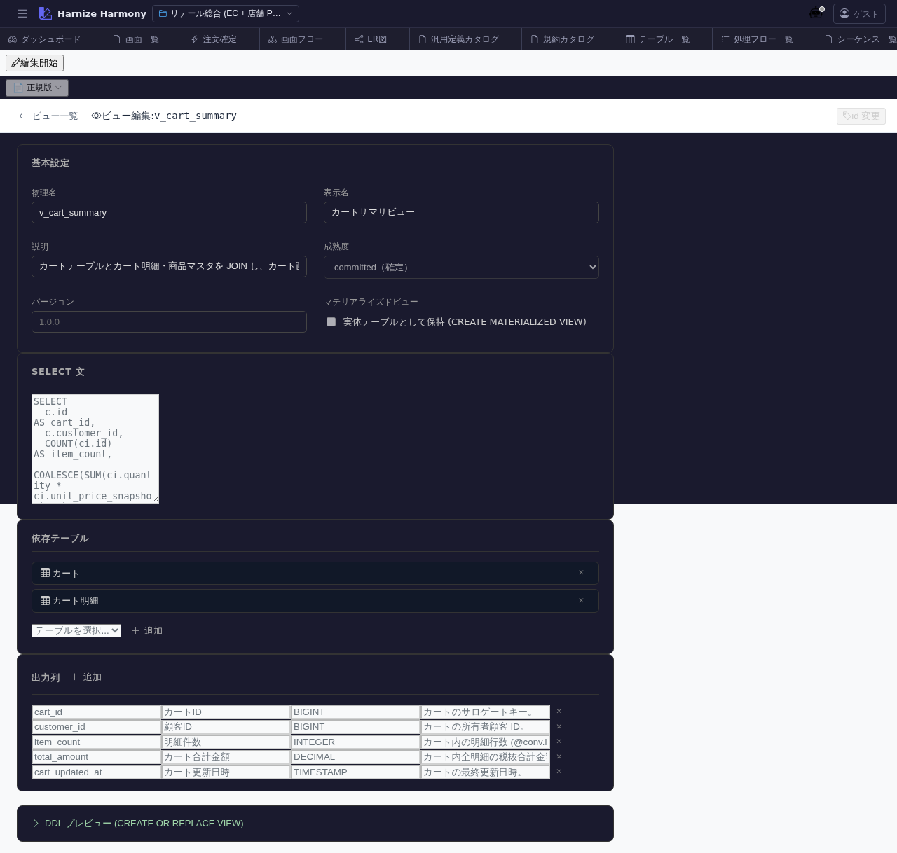

# DB ビュー編集

> **対象画面**: `ViewEditor` (`frontend/src/components/view/ViewEditor.tsx`)
> **ルート**: `/w/:wsId/view/edit/:viewId`
> **種別**: マルチインスタンスタブ

## 概要

DB ビュー (`CREATE VIEW`) を 1 件編集する。複数テーブルを join した projection や、業務ロジックを含む集計を定義し、`/generate-code` の DDL 生成対象にする。`ViewDefinition` (画面 projection) とは別物。

## 到達経路

- DB ビュー一覧 (`/view/list`) → 行クリック
- 直接 URL: `/w/<wsId>/view/edit/<viewId>`

## 画面構成

### 主要エリア

1. **EditorHeader** — ビュー名 + id 変更 + 保存
2. **基本情報** — 名前 / 論理名 / 説明 / source tables 一覧 / 成熟度
3. **カラム定義** — view の出力カラム (名前 / 型 / 由来 source column / 計算式) 一覧
4. **SQL preview** — 設定から生成される SELECT 文プレビュー (dialect 中立)

## 主要操作

| 操作 | 手段 | 結果 |
|---|---|---|
| カラム追加 | 「カラムを追加」 | source column 指定 or 式入力 |
| join 追加 | 「source 追加」 | 別 table を結合 (join type + on 条件) |
| WHERE 条件 | 「filter」セクション | 行絞込み条件を式言語で書く |
| SQL preview 更新 | 自動 | 設定変更時に preview 再生成 |
| 保存 / 破棄 | `Ctrl+S` / 「破棄」 | edit-session 経由 |
| rename | EditorHeader の id 変更 | RenameEntityDialog |

## データ前提

- **新規**: source tables 0 件、最低 1 source 選択から開始
- **意味のある状態**: retail の `cart-summary-view` は cart + cart-item を join して合計金額カラムを含む

## 関連仕様書

- [`docs/spec/process-flow-expression-language.md`](../../spec/process-flow-expression-language.md) — view 定義内の式
- [`docs/spec/view-definition.md`](../../spec/view-definition.md) — 画面 projection (本画面とは別物) との違い

## 関連 skill

- `/generate-code` — `CREATE VIEW` DDL を techStack に従い dialect 翻訳して生成

## 既知の制約・注意

- **DB ビュー (本画面) と ViewDefinition (`view-definition-editor`) を混同しない**
- ビューを参照する process-flow / table がある場合、削除前に必ず参照解消すること
- 集計関数 (`SUM` / `COUNT` 等) は **GROUP BY 暗黙推定** をしないので明示指定が必要
