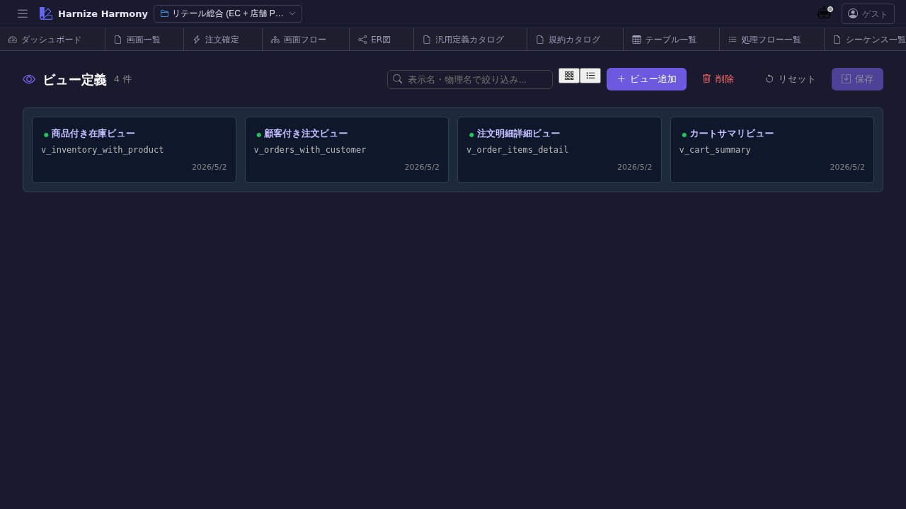

# DB ビュー一覧

> **対象画面**: `ViewListView` (`frontend/src/components/view/ViewListView.tsx`)
> **ルート**: `/w/:wsId/view/list`
> **種別**: シングルトンタブ

## 概要

DB ビュー (`CREATE VIEW`) 定義を一覧する。複数テーブルを join したサマリ表現 (例: `order-with-customer-view` / `inventory-with-product-view`) を framework 横断で管理。`ViewDefinition` (画面向け projection) とは別の、**DB 層のビュー** を扱う。

## 到達経路

- HeaderMenu → 「DB ビュー」 → 「一覧」
- 直接 URL: `/w/<wsId>/view/list`

## 画面構成

### 主要エリア

1. **ヘッダー** — タイトル「DB ビュー一覧」 + 件数 + 「ビューを追加」
2. **一覧** — ビュー名 / source table 数 / カラム数 / 成熟度 / 説明

## 主要操作

| 操作 | 手段 | 結果 |
|---|---|---|
| 新規作成 | 「ビューを追加」 | `ViewEditor` 新タブ |
| 編集 | 行クリック | `/view/edit/:id` 新タブ |
| 削除 | 右クリック → 「削除」 / `Delete` | 参照ありは警告 |
| rename | 右クリック → 「ID 変更…」 / `F2` | RenameEntityDialog |

## データ前提

- **空状態**: 「DB ビューが未登録です」
- **意味のある状態**: retail で `cart-summary-view` / `inventory-with-product-view` / `order-item-detail-view` / `order-with-customer-view` の 4 件

## 関連仕様書

- [`docs/spec/list-common.md`](../../spec/list-common.md)
- [`docs/spec/view-definition.md`](../../spec/view-definition.md) — **画面向け projection** との違い (ViewDefinition は画面表示用、本画面の View は DB 層)

## 関連 skill

- `/generate-code` — techStack に基づき `CREATE VIEW` DDL を生成

## 既知の制約・注意

- **`View` (DB ビュー) と `ViewDefinition` (画面表示 projection) を混同しない**こと。本画面は前者、`view-definition-list` は後者
- view 内の SQL 表現は **dialect 中立**で書く (postgres / mysql 等で翻訳される)
