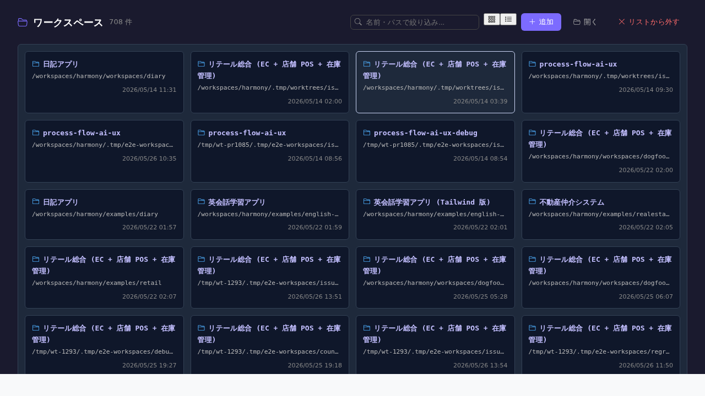

# ワークスペース一覧

> **対象画面**: `WorkspaceListView` (`frontend/src/components/workspace/WorkspaceListView.tsx`)
> **ルート**: `/workspace/list` (top-level)
> **種別**: シングルトンタブ

## 概要

backend が認識している **全ワークスペース** (recent + active) を一覧する画面。各 workspace の path / 名前 / 最終アクセス時刻 / ロックダウン状態を確認でき、ワークスペースの切替 / 削除 (recent からの除去) / 新規追加が可能。`/workspace/select` (welcome 画面) と並ぶ workspace 管理画面の中心。

## 到達経路

- ヘッダーのワークスペース表示部分 → 「ワークスペース一覧」
- `/workspace/select` (welcome) → 「ワークスペース一覧へ」
- 直接 URL: `/workspace/list` (workspace 不要、top-level route)

## 画面構成

### 主要エリア

1. **ヘッダー** — タイトル「ワークスペース一覧」 + 件数 + 「ワークスペースを追加」
2. **active バッジ** — 現在 backend に bind 中の workspace 1 件をハイライト
3. **一覧** — 名前 / path / 最終アクセス / ロックダウン (`DESIGNER_DATA_DIR` env 設定済) かどうか / カード or 表
4. **フィルタ** — 名前 / path 部分一致
5. **ソート** — 最終アクセス時刻 (デフォルト降順) / 名前

## 主要操作

| 操作 | 手段 | 結果 |
|---|---|---|
| 切替 | カード / 行クリック | `/w/<wsId>/` に遷移、backend 側 active workspace 切替 |
| 追加 | 「ワークスペースを追加」 | path 入力モーダル → `harmony.json` 検出 → 確認 → 開く |
| recent から削除 | 行右クリック → 「一覧から削除」 | recent list から外す (ファイルは消えない) |
| 名前変更 | 行の編集アイコン | inline rename |

## データ前提

- **空状態**: recent 0 件、「ワークスペースを追加」のみ
- **意味のある状態**: 過去開いた workspace が 5+ 件並ぶ、retail / diary / dogfood-* 等
- **lockdown モード**: `DESIGNER_DATA_DIR` env が backend 起動時に設定されている場合、recent 切替不可で固定 (画面側で警告表示)

## 関連仕様書

- [`docs/spec/workspace.md`](../../spec/workspace.md) — workspace 概念 (active / lockdown / recent / 切替プロトコル)
- [`docs/spec/workspace-multi.md`](../../spec/workspace-multi.md) — 複数 workspace 同時並行編集 (v2、#679 シリーズ)
- [`docs/spec/list-common.md`](../../spec/list-common.md)

## 関連 skill

- なし

## 既知の制約・注意

- **`/workspace/list` は top-level route** (workspace 不要)。`/w/:wsId/workspace/list` ではない
- backend の active workspace は 1 つだけ。本画面で切替するとブラウザの開いている他タブは一旦リダイレクト
- recent 一覧は backend の `~/.harmony/recent-workspaces.json` 等で永続化 (実装は backend 側)
